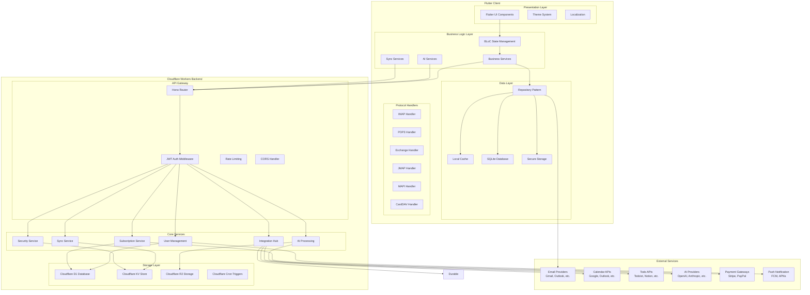
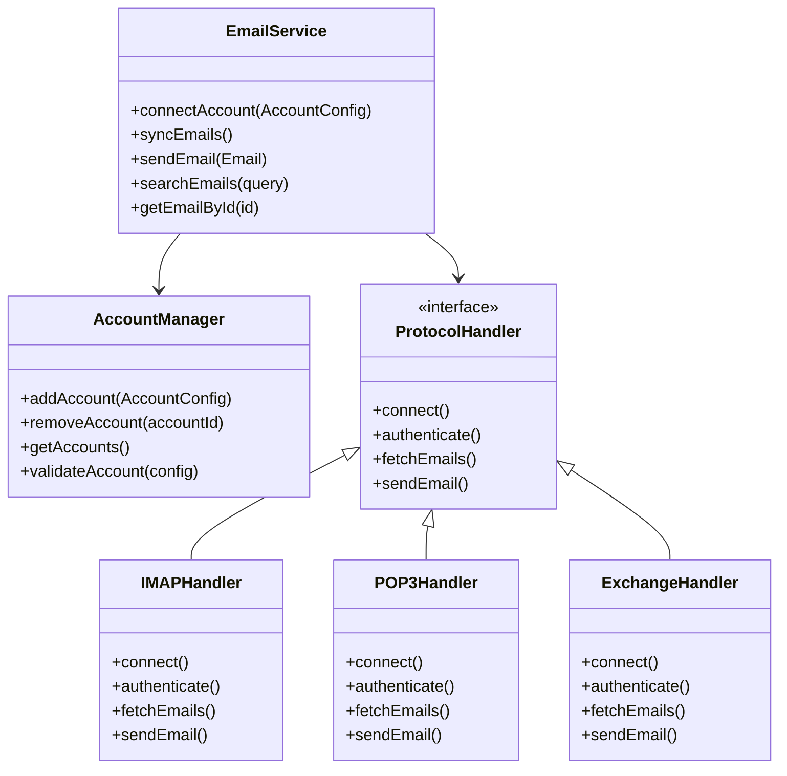
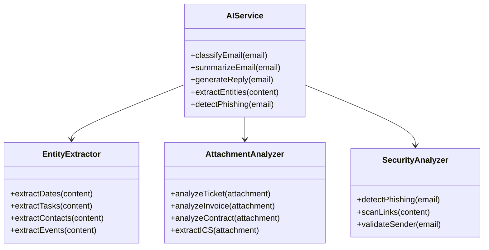
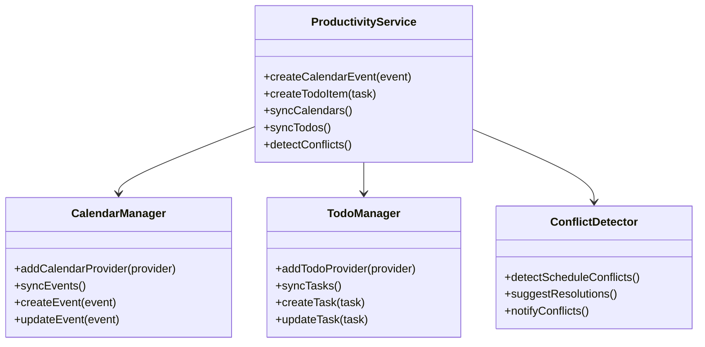
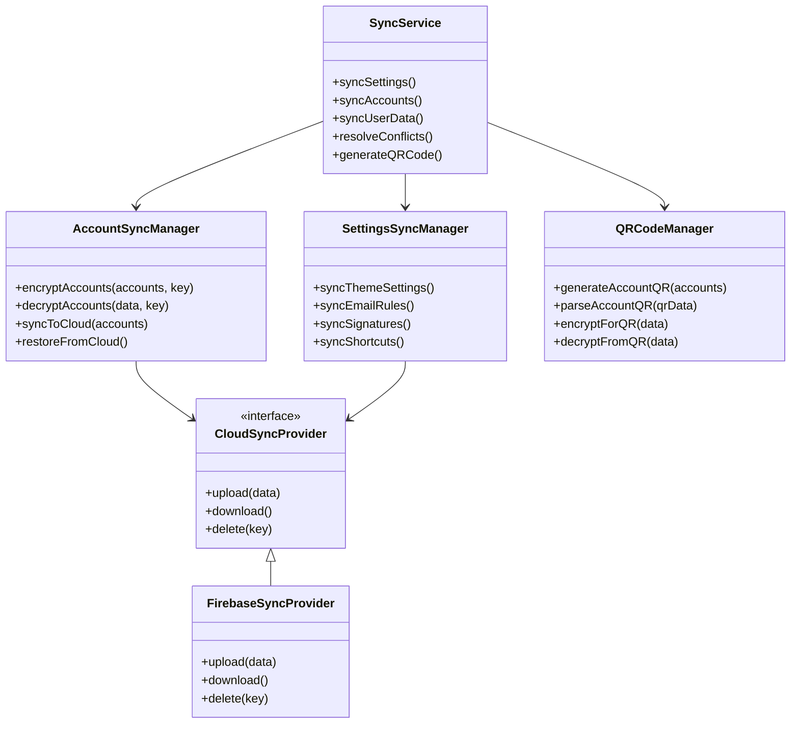
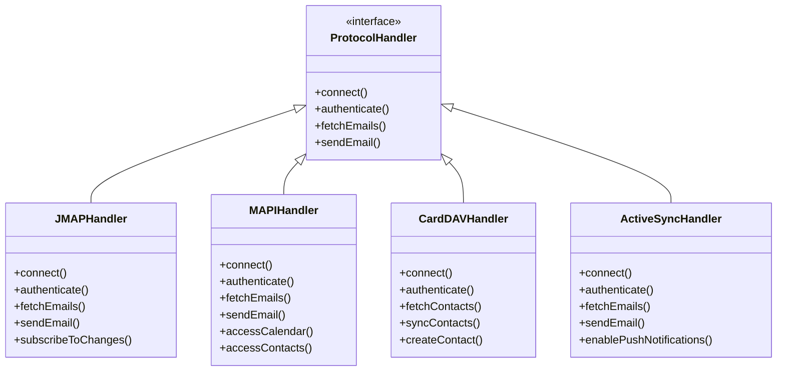
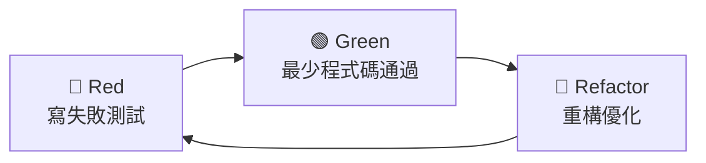
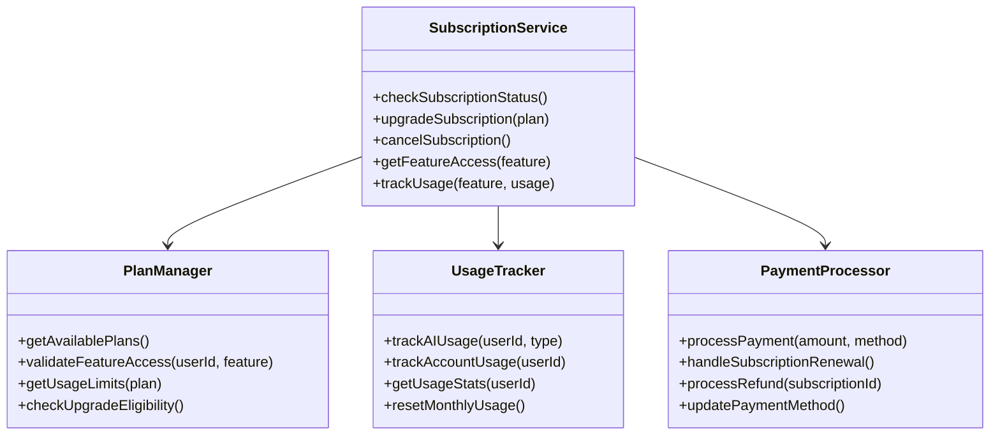
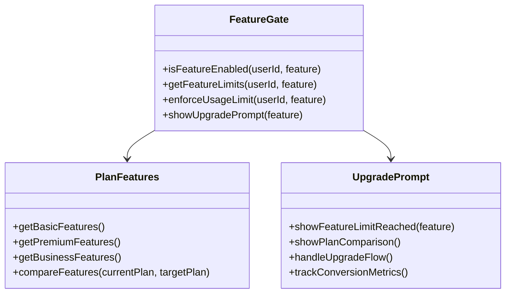

# Design Document

## Overview

Awesome Mail 是一個使用 Flutter 開發的跨平台郵件客戶端，整合 AI 功能和多平台生產力工具。本設計文件基於已確認的需求，提供詳細的技術架構、組件設計和實作策略。

### 核心設計原則

1. **跨平台一致性** - 使用 Flutter 確保所有平台的一致體驗
2. **模組化架構** - 採用清晰的分層架構，便於維護和擴展
3. **安全優先** - 所有通訊和資料儲存都採用加密保護
4. **效能優化** - 使用虛擬滾動、快取和背景同步優化效能
5. **AI 驅動** - 深度整合 AI 功能提升使用者體驗
6. **擴展性** - 支援插件系統和第三方整合
7. **測試驅動** - 採用 TDD 方法確保程式碼品質和可維護性

### 開發指導原則

#### 核心理念
- **漸進式開發勝過大爆炸式** - 小幅變更，確保編譯通過和測試成功
- **從現有程式碼學習** - 研究和規劃後再實作
- **實用主義勝過教條主義** - 適應專案現實
- **清晰意圖勝過聰明程式碼** - 選擇無聊且明顯的解決方案

#### 簡潔性原則
- 每個函數/類別單一職責
- 避免過早抽象化
- 不使用聰明技巧 - 選擇無聊的解決方案
- 如果需要解釋，就太複雜了

#### 架構原則
- **組合勝過繼承** - 使用依賴注入
- **介面勝過單例** - 啟用測試和靈活性
- **明確勝過隱含** - 清晰的資料流和依賴關係
- **盡可能測試驅動** - 永不停用測試，修復它們

#### 決策框架
當存在多個有效方法時，基於以下順序選擇：
1. **可測試性** - 我能輕易測試這個嗎？
2. **可讀性** - 6 個月後有人能理解這個嗎？
3. **一致性** - 這符合專案模式嗎？
4. **簡潔性** - 這是有效的最簡單解決方案嗎？
5. **可逆性** - 之後改變有多困難？

## Architecture

### 整體架構圖



### 分層架構詳細說明

#### Flutter Client 層

##### 1. Presentation Layer（展示層）
- **Flutter UI Components** - 跨平台 UI 組件
- **Theme System** - 支援多主題和自訂樣式
- **Localization** - 多語言支援系統

##### 2. Business Logic Layer（業務邏輯層）
- **BLoC State Management** - 狀態管理和事件處理
- **Business Services** - 核心業務邏輯服務
- **AI Services** - AI 功能整合服務
- **Sync Services** - 跨平台同步服務

##### 3. Data Layer（資料層）
- **Repository Pattern** - 資料存取抽象層
- **Local Cache** - 記憶體快取系統
- **SQLite Database** - 本地資料庫
- **Secure Storage** - 敏感資料安全儲存

##### 4. Protocol Handlers（協議處理器）
- **IMAP Handler** - IMAP 協議處理
- **POP3 Handler** - POP3 協議處理
- **Exchange Handler** - Exchange/EWS 協議處理
- **JMAP Handler** - JMAP 協議處理
- **MAPI Handler** - MAPI 協議處理
- **CardDAV Handler** - CardDAV 聯絡人同步

#### Cloudflare Workers Backend 層

##### 1. API Gateway（API 閘道）
- **Hono Router** - 高效能 HTTP 路由框架
- **JWT Auth Middleware** - JWT 認證中介軟體
- **Rate Limiting** - API 請求頻率限制
- **CORS Handler** - 跨域請求處理

##### 2. Core Services（核心服務）
- **User Management** - 使用者帳戶管理
- **Sync Service** - 跨設備同步服務
- **AI Processing** - AI 功能處理服務
- **Subscription Service** - 訂閱方案管理
- **Security Service** - 安全認證服務
- **Integration Hub** - 第三方服務整合中心

##### 3. Storage Layer（儲存層）
- **Cloudflare D1** - 關聯式資料庫（使用者資料、訂閱資訊）
- **Cloudflare KV** - 鍵值儲存（快取、設定同步、任務佇列）
- **Cloudflare R2** - 物件儲存（AI 模型、附件快取）
- **Cloudflare Cron Triggers** - 定時任務處理（背景同步、清理作業）

#### External Services（外部服務）
- **Email Providers** - Gmail、Outlook、Yahoo 等郵件服務
- **Calendar APIs** - Google Calendar、Outlook Calendar 等
- **Todo APIs** - Todoist、Notion、Asana 等待辦事項服務
- **AI Providers** - OpenAI、Anthropic、Google AI 等
- **Payment Gateways** - Stripe、PayPal 等付費處理
- **Push Services** - FCM、APNs 推播通知服務

## Cloudflare Workers Backend Architecture

### Cloudflare Workers 服務架構

```mermaid
graph TB
    subgraph "Cloudflare Workers"
        subgraph "API Routes"
            AuthAPI[/auth/*]
            UserAPI[/users/*]
            SyncAPI[/sync/*]
            AIAPI[/ai/*]
            SubAPI[/subscriptions/*]
            IntegrationAPI[/integrations/*]
        end
        
        subgraph "Middleware Stack"
            AuthMW[Authentication]
            RateMW[Rate Limiting]
            ValidMW[Request Validation]
            LogMW[Logging]
        end
        
        subgraph "Business Logic"
            AuthService[Authentication Service]
            UserMgmt[User Management]
            SyncMgmt[Sync Management]
            AIMgmt[AI Processing]
            SubMgmt[Subscription Management]
            IntegMgmt[Integration Management]
        end
        
        subgraph "Data Access"
            D1Repo[D1 Repository]
            KVRepo[KV Repository]
            R2Repo[R2 Repository]
            DurableRepo[Durable Objects]
        end
    end
    
    subgraph "Cloudflare Services"
        D1DB[(D1 Database)]
        KVStore[(KV Store)]
        R2Storage[(R2 Storage)]
        CronTriggers[Cron Triggers]
        Analytics[Analytics]
        Cache[Cache API]
    end
    
    AuthAPI --> AuthMW
    UserAPI --> AuthMW
    SyncAPI --> AuthMW
    AIAPI --> AuthMW
    SubAPI --> AuthMW
    IntegrationAPI --> AuthMW
    
    AuthMW --> RateMW
    RateMW --> ValidMW
    ValidMW --> LogMW
    
    LogMW --> AuthService
    LogMW --> UserMgmt
    LogMW --> SyncMgmt
    LogMW --> AIMgmt
    LogMW --> SubMgmt
    LogMW --> IntegMgmt
    
    AuthService --> D1Repo
    UserMgmt --> D1Repo
    SyncMgmt --> KVRepo
    AIMgmt --> R2Repo
    SubMgmt --> D1Repo
    IntegMgmt --> DurableRepo
    
    D1Repo --> D1DB
    KVRepo --> KVStore
    R2Repo --> R2Storage
    DurableRepo --> DurableObj
```

### Cloudflare Workers 技術棧

#### 1. 框架和工具
- **Hono** - 輕量級 HTTP 框架
- **Wrangler** - Cloudflare Workers CLI 工具
- **TypeScript** - 型別安全的開發語言
- **Zod** - 資料驗證和型別推斷
- **Jose** - JWT 處理庫

#### 2. Cloudflare 服務整合
- **D1 Database** - SQLite 相容的邊緣資料庫
- **KV Store** - 全球分散式鍵值儲存
- **R2 Storage** - S3 相容的物件儲存
- **Durable Objects** - 強一致性狀態管理
- **Workers Analytics** - 效能和使用量分析
- **Cache API** - 邊緣快取服務

#### 3. 安全和效能
- **Edge Runtime** - 全球邊緣運算
- **Zero Cold Start** - 無冷啟動延遲
- **Automatic Scaling** - 自動擴展
- **DDoS Protection** - 內建 DDoS 防護
- **SSL/TLS** - 自動 HTTPS 加密

### Backend API 設計

#### 1. 認證服務 API

```typescript
// POST /auth/login
interface LoginRequest {
  email: string;
  password: string;
  deviceId: string;
}

interface LoginResponse {
  accessToken: string;
  refreshToken: string;
  user: UserProfile;
  expiresIn: number;
}

// POST /auth/refresh
interface RefreshRequest {
  refreshToken: string;
}

// POST /auth/register
interface RegisterRequest {
  email: string;
  password: string;
  name: string;
  deviceId: string;
}
```

#### 2. 同步服務 API

```typescript
// GET /sync/settings
interface SyncSettingsResponse {
  settings: UserSettings;
  lastModified: string;
  version: number;
}

// PUT /sync/settings
interface SyncSettingsRequest {
  settings: UserSettings;
  version: number;
}

// POST /sync/accounts
interface SyncAccountsRequest {
  encryptedAccounts: string;
  deviceId: string;
  masterKeyHash: string;
}

// GET /sync/qr-code
interface QRCodeResponse {
  qrCode: string;
  expiresAt: string;
  transferId: string;
}
```

#### 3. AI 服務 API

```typescript
// POST /ai/classify
interface ClassifyEmailRequest {
  emailContent: string;
  subject: string;
  sender: string;
}

interface ClassifyEmailResponse {
  category: string;
  confidence: number;
  tags: string[];
  priority: 'low' | 'medium' | 'high';
}

// POST /ai/summarize
interface SummarizeRequest {
  content: string;
  maxLength?: number;
}

interface SummarizeResponse {
  summary: string;
  keyPoints: string[];
}

// POST /ai/generate-reply
interface GenerateReplyRequest {
  originalEmail: string;
  context?: string;
  tone?: 'formal' | 'casual' | 'friendly';
}

interface GenerateReplyResponse {
  suggestions: string[];
  confidence: number;
}
```

#### 4. 訂閱服務 API

```typescript
// GET /subscriptions/status
interface SubscriptionStatusResponse {
  plan: 'basic' | 'premium' | 'business';
  status: 'active' | 'trial' | 'expired';
  expiresAt: string;
  usage: UsageStats;
  limits: PlanLimits;
}

// POST /subscriptions/upgrade
interface UpgradeRequest {
  planId: string;
  paymentMethodId: string;
}

// GET /subscriptions/usage
interface UsageStatsResponse {
  aiRequests: number;
  accountsConnected: number;
  storageUsed: number;
  resetDate: string;
}
```

## Components and Interfaces

### 核心組件架構

#### 1. Email Management System



#### 2. AI Integration System



#### 3. Productivity Integration System



#### 4. Cross-Platform Sync System



#### 5. Extended Protocol Handler System



### 介面定義

#### 1. Email Provider Interface

```dart
abstract class EmailProvider {
  Future<void> connect(AccountConfig config);
  Future<void> authenticate();
  Future<List<Email>> fetchEmails({int limit, String folder});
  Future<void> sendEmail(Email email);
  Future<List<Folder>> getFolders();
  Future<void> markAsRead(String emailId);
  Future<void> deleteEmail(String emailId);
  Future<void> moveEmail(String emailId, String targetFolder);
}
```

#### 2. AI Provider Interface

```dart
abstract class AIProvider {
  Future<EmailClassification> classifyEmail(String content);
  Future<String> summarizeContent(String content);
  Future<List<String>> generateReplies(String content);
  Future<List<Entity>> extractEntities(String content);
  Future<SecurityAnalysis> analyzeSecurityThreats(Email email);
}
```

#### 3. Calendar Provider Interface

```dart
abstract class CalendarProvider {
  Future<void> authenticate();
  Future<List<CalendarEvent>> getEvents(DateRange range);
  Future<CalendarEvent> createEvent(CalendarEvent event);
  Future<void> updateEvent(CalendarEvent event);
  Future<void> deleteEvent(String eventId);
  Future<List<Calendar>> getCalendars();
}
```

#### 4. Sync Provider Interface

```dart
abstract class SyncProvider {
  Future<void> uploadData(String key, Map<String, dynamic> data);
  Future<Map<String, dynamic>> downloadData(String key);
  Future<void> deleteData(String key);
  Future<List<String>> listKeys();
  Future<bool> dataExists(String key);
}

// Cloudflare Workers Backend Interface
abstract class CloudflareBackendService {
  Future<AuthResponse> authenticate(String email, String password);
  Future<void> refreshToken(String refreshToken);
  Future<SyncResponse> syncSettings(Map<String, dynamic> settings);
  Future<AIResponse> processAIRequest(AIRequest request);
  Future<SubscriptionStatus> getSubscriptionStatus();
  Future<void> trackUsage(String feature, int usage);
}
```

#### 5. Account Sync Interface

```dart
abstract class AccountSyncManager {
  Future<void> syncAccountsToCloud(List<AccountConfig> accounts, String masterKey);
  Future<List<AccountConfig>> restoreAccountsFromCloud(String masterKey);
  Future<String> generateAccountQRCode(List<AccountConfig> accounts);
  Future<List<AccountConfig>> parseAccountQRCode(String qrData);
  Future<bool> isDeviceAuthorized(String deviceId);
  Future<void> authorizeDevice(String deviceId, String verificationCode);
}
```

#### 6. Extended Protocol Interfaces

```dart
// JMAP Protocol Interface
abstract class JMAPProvider extends EmailProvider {
  Future<void> subscribeToChanges();
  Future<List<EmailChange>> getChanges(String sinceState);
  Future<void> pushNotification(String endpoint);
}

// MAPI Protocol Interface
abstract class MAPIProvider extends EmailProvider {
  Future<List<Contact>> getContacts();
  Future<List<CalendarEvent>> getCalendarEvents();
  Future<List<Task>> getTasks();
  Future<void> createCalendarEvent(CalendarEvent event);
}

// CardDAV Protocol Interface
abstract class CardDAVProvider {
  Future<void> authenticate();
  Future<List<Contact>> getContacts();
  Future<Contact> createContact(Contact contact);
  Future<void> updateContact(Contact contact);
  Future<void> deleteContact(String contactId);
  Future<void> syncContacts();
}
```

## Data Models

### 核心資料模型

#### 1. Email Model

```dart
class Email {
  final String id;
  final String accountId;
  final String subject;
  final String body;
  final String htmlBody;
  final EmailAddress from;
  final List<EmailAddress> to;
  final List<EmailAddress> cc;
  final List<EmailAddress> bcc;
  final DateTime receivedAt;
  final DateTime sentAt;
  final List<Attachment> attachments;
  final EmailFlags flags;
  final String folderId;
  final Map<String, dynamic> metadata;
  
  // AI 增強欄位
  final EmailClassification? classification;
  final String? aiSummary;
  final List<Entity>? extractedEntities;
  final SecurityAnalysis? securityAnalysis;
}

class EmailFlags {
  final bool isRead;
  final bool isStarred;
  final bool isImportant;
  final bool isSpam;
  final bool isDeleted;
  final bool hasDraft;
}

class EmailClassification {
  final String category;
  final double confidence;
  final List<String> tags;
  final Priority priority;
}
```

#### 2. Account Model

```dart
class AccountConfig {
  final String id;
  final String name;
  final String email;
  final AccountType type;
  final ServerConfig? imapConfig;
  final ServerConfig? smtpConfig;
  final OAuthConfig? oauthConfig;
  final EncryptionConfig? encryptionConfig;
  final bool isActive;
  final DateTime createdAt;
  final DateTime lastSyncAt;
}

class ServerConfig {
  final String host;
  final int port;
  final SecurityType security;
  final String username;
  final String password;
}

enum AccountType {
  gmail,
  outlook,
  yahoo,
  icloud,
  protonmail,
  exchange,
  imap,
  pop3
}
```

#### 3. Productivity Models

```dart
class CalendarEvent {
  final String id;
  final String title;
  final String description;
  final DateTime startTime;
  final DateTime endTime;
  final String location;
  final List<String> attendees;
  final String calendarId;
  final String providerId;
  final String? linkedEmailId;
  final EventRecurrence? recurrence;
}

class TodoItem {
  final String id;
  final String title;
  final String description;
  final DateTime? dueDate;
  final Priority priority;
  final TodoStatus status;
  final String providerId;
  final String? linkedEmailId;
  final List<String> tags;
  final String? projectId;
}

class Entity {
  final EntityType type;
  final String value;
  final double confidence;
  final Map<String, dynamic> metadata;
}

enum EntityType {
  date,
  time,
  person,
  organization,
  location,
  task,
  event,
  amount,
  phoneNumber,
  email
}
```

#### 4. Sync and Settings Models

```dart
class SyncSettings {
  final bool enableAccountSync;
  final bool enableSettingsSync;
  final bool enableAIDataSync;
  final SyncFrequency frequency;
  final List<String> trustedDevices;
  final DateTime lastSyncAt;
  final String syncProviderId;
}

class DeviceInfo {
  final String deviceId;
  final String deviceName;
  final String platform;
  final String appVersion;
  final DateTime lastActiveAt;
  final bool isTrusted;
  final String publicKey;
}

class SyncConflict {
  final String key;
  final dynamic localValue;
  final dynamic remoteValue;
  final DateTime localTimestamp;
  final DateTime remoteTimestamp;
  final ConflictType type;
  final ConflictResolution? resolution;
}

class QRCodeData {
  final List<AccountConfig> accounts;
  final Map<String, dynamic> settings;
  final String encryptionKey;
  final DateTime expiresAt;
  final String deviceId;
}

enum SyncFrequency {
  realtime,
  every5minutes,
  every15minutes,
  hourly,
  daily,
  manual
}

enum ConflictType {
  settings,
  accounts,
  emailRules,
  templates,
  aiData
}

enum ConflictResolution {
  useLocal,
  useRemote,
  merge,
  askUser
}
```

#### 5. Extended Protocol Models

```dart
class JMAPSession {
  final String sessionId;
  final Map<String, String> capabilities;
  final String apiUrl;
  final String downloadUrl;
  final String uploadUrl;
  final String eventSourceUrl;
}

class MAPISession {
  final String sessionId;
  final String serverVersion;
  final List<String> supportedFeatures;
  final String exchangeVersion;
}

class Contact {
  final String id;
  final String displayName;
  final String firstName;
  final String lastName;
  final List<EmailAddress> emails;
  final List<PhoneNumber> phoneNumbers;
  final Address? address;
  final String? organization;
  final String? jobTitle;
  final DateTime? birthday;
  final String? notes;
  final String providerId;
  final DateTime createdAt;
  final DateTime updatedAt;
}

class PhoneNumber {
  final String number;
  final PhoneType type;
  final String? label;
}

class Address {
  final String street;
  final String city;
  final String state;
  final String postalCode;
  final String country;
  final AddressType type;
}

enum PhoneType {
  home,
  work,
  mobile,
  fax,
  other
}

enum AddressType {
  home,
  work,
  other
}
```

## Error Handling

### 錯誤處理策略

#### 1. 分層錯誤處理

```dart
// 自訂例外類別
abstract class AwesomeMailException implements Exception {
  final String message;
  final String code;
  final dynamic originalError;
  
  const AwesomeMailException(this.message, this.code, [this.originalError]);
}

class NetworkException extends AwesomeMailException {
  const NetworkException(String message) : super(message, 'NETWORK_ERROR');
}

class AuthenticationException extends AwesomeMailException {
  const AuthenticationException(String message) : super(message, 'AUTH_ERROR');
}

class EmailProviderException extends AwesomeMailException {
  const EmailProviderException(String message, String provider) 
    : super(message, 'PROVIDER_ERROR_$provider');
}
```

#### 2. 錯誤恢復機制

- **網路錯誤** - 自動重試機制，指數退避策略
- **認證錯誤** - 自動重新認證，提示使用者更新憑證
- **同步錯誤** - 部分同步，錯誤記錄和稍後重試
- **AI 服務錯誤** - 降級到基本功能，快取結果重用

#### 3. 使用者友善錯誤訊息

```dart
class ErrorMessageService {
  static String getLocalizedMessage(AwesomeMailException error, String locale) {
    switch (error.code) {
      case 'NETWORK_ERROR':
        return _getNetworkErrorMessage(locale);
      case 'AUTH_ERROR':
        return _getAuthErrorMessage(locale);
      default:
        return _getGenericErrorMessage(locale);
    }
  }
}
```

## Testing Strategy

### 測試架構

#### 1. 單元測試 (Unit Tests)
- **業務邏輯測試** - 所有 Service 和 Repository 類別
- **資料模型測試** - 序列化/反序列化、驗證邏輯
- **工具函數測試** - 加密、解析、格式化函數
- **AI 功能測試** - Mock AI 服務回應測試

#### 2. 整合測試 (Integration Tests)
- **郵件提供商整合** - 實際 API 連接測試
- **資料庫操作** - SQLite 操作和遷移測試
- **跨服務整合** - 郵件與生產力工具整合測試

#### 3. Widget 測試 (Widget Tests)
- **UI 組件測試** - 所有自訂 Widget 的行為測試
- **狀態管理測試** - BLoC 狀態變化和事件處理
- **使用者互動測試** - 手勢、輸入、導航測試

#### 4. 端到端測試 (E2E Tests)
- **完整使用者流程** - 從帳戶設定到郵件處理的完整流程
- **跨平台測試** - 在不同平台上的行為一致性
- **效能測試** - 大量資料處理和記憶體使用測試

### TDD 開發流程

#### Red-Green-Refactor 循環


#### TDD 最佳實踐
- **測試先行** - 每個功能都先寫測試再實作
- **小步迭代** - 每次只實作一個小功能
- **快速回饋** - 頻繁執行測試確保程式碼正確
- **重構安全** - 有測試保護的重構更安全

### 測試工具和框架

```yaml
dev_dependencies:
  flutter_test: ^1.0.0
  mockito: ^5.4.0
  bloc_test: ^9.1.0
  integration_test: ^1.0.0
  alchemist: ^0.12.1
  patrol: ^2.0.0  # 進階 E2E 測試
  
  # 後端測試工具
  vitest: ^1.0.0  # Cloudflare Workers 測試
  supertest: ^6.0.0  # API 測試
  @cloudflare/workers-types: ^4.0.0
```

### TDD 測試資料管理

#### Flutter 測試資料工廠
```dart
class TestDataFactory {
  static Email createTestEmail({
    String? subject,
    String? body,
    EmailAddress? from,
  }) {
    return Email(
      id: 'test_${DateTime.now().millisecondsSinceEpoch}',
      subject: subject ?? 'Test Subject',
      body: body ?? 'Test Body',
      from: from ?? EmailAddress('test@example.com', 'Test User'),
      // ... 其他預設值
    );
  }
  
  static AccountConfig createTestAccount(AccountType type) {
    // 根據帳戶類型建立測試配置
  }
  
  // TDD 測試場景資料
  static List<Email> createEmailTestSuite() {
    return [
      createTestEmail(subject: 'Meeting Request'),
      createTestEmail(subject: 'Invoice #12345'),
      createTestEmail(subject: 'Flight Confirmation'),
      // 涵蓋各種 AI 分類場景
    ];
  }
}
```

#### 後端測試資料工廠
```typescript
export class BackendTestFactory {
  static createTestUser(overrides?: Partial<User>): User {
    return {
      id: crypto.randomUUID(),
      email: 'test@example.com',
      name: 'Test User',
      createdAt: new Date().toISOString(),
      ...overrides
    };
  }
  
  static createTestEmail(overrides?: Partial<EmailData>): EmailData {
    return {
      id: crypto.randomUUID(),
      subject: 'Test Email',
      body: 'Test email body',
      from: 'sender@example.com',
      receivedAt: new Date().toISOString(),
      ...overrides
    };
  }
  
  // Mock AI 回應
  static createMockAIResponse(type: 'classify' | 'summarize' | 'reply') {
    switch (type) {
      case 'classify':
        return { category: 'work', confidence: 0.95, tags: ['meeting'] };
      case 'summarize':
        return { summary: 'Test summary', keyPoints: ['Point 1'] };
      case 'reply':
        return { suggestions: ['Thank you for your email.'] };
    }
  }
}
```

## Security Considerations

### 安全架構設計

#### 1. 資料加密

```dart
class EncryptionService {
  // 本地資料加密
  Future<String> encryptLocalData(String data, String key);
  Future<String> decryptLocalData(String encryptedData, String key);
  
  // 郵件內容加密 (PGP/S/MIME)
  Future<String> encryptEmail(String content, String publicKey);
  Future<String> decryptEmail(String encryptedContent, String privateKey);
  
  // 憑證安全儲存
  Future<void> storeCredentials(String accountId, Credentials credentials);
  Future<Credentials> getCredentials(String accountId);
}
```

#### 2. 安全通訊

- **TLS/SSL 強制** - 所有網路通訊使用加密連線
- **憑證驗證** - 驗證伺服器憑證有效性
- **HSTS 支援** - HTTP Strict Transport Security
- **憑證釘選** - 防止中間人攻擊

#### 3. 隱私保護

```dart
class PrivacyService {
  // 追蹤保護
  Future<String> sanitizeEmailContent(String htmlContent);
  
  // 資料匿名化
  Future<void> anonymizeUserData();
  
  // 資料清理
  Future<void> clearSensitiveData();
  
  // 隱私模式
  Future<void> enablePrivacyMode();
}
```

#### 4. 威脅偵測

```dart
class SecurityAnalyzer {
  Future<ThreatAnalysis> analyzeEmail(Email email) async {
    final phishingScore = await _detectPhishing(email);
    final malwareScore = await _scanAttachments(email.attachments);
    final linkSafety = await _analyzeLinkSafety(email.body);
    
    return ThreatAnalysis(
      phishingScore: phishingScore,
      malwareScore: malwareScore,
      linkSafety: linkSafety,
      overallRisk: _calculateOverallRisk([phishingScore, malwareScore]),
    );
  }
}
```

#### 5. 同步安全

```dart
class SyncSecurity {
  // 端到端加密同步資料
  Future<String> encryptSyncData(Map<String, dynamic> data, String userKey) async {
    final jsonData = jsonEncode(data);
    final salt = _generateSalt();
    final derivedKey = await _deriveKey(userKey, salt);
    final encryptedData = await _aes256GcmEncrypt(jsonData, derivedKey);
    
    return base64Encode({
      'salt': salt,
      'data': encryptedData,
      'version': '1.0'
    });
  }
  
  // 解密同步資料
  Future<Map<String, dynamic>> decryptSyncData(String encryptedData, String userKey) async {
    final decoded = base64Decode(encryptedData);
    final salt = decoded['salt'];
    final data = decoded['data'];
    
    final derivedKey = await _deriveKey(userKey, salt);
    final decryptedJson = await _aes256GcmDecrypt(data, derivedKey);
    
    return jsonDecode(decryptedJson);
  }
  
  // 設備授權驗證
  Future<bool> verifyDeviceAuthorization(String deviceId, String signature) async {
    final publicKey = await _getDevicePublicKey(deviceId);
    return await _verifySignature(deviceId, signature, publicKey);
  }
  
  // QR Code 安全生成
  Future<String> generateSecureQRCode(Map<String, dynamic> data) async {
    final tempKey = _generateTempKey();
    final encryptedData = await _encryptWithTempKey(data, tempKey);
    final expiryTime = DateTime.now().add(Duration(minutes: 5));
    
    return jsonEncode({
      'data': encryptedData,
      'key': tempKey,
      'expires': expiryTime.toIso8601String(),
    });
  }
}
```

### 合規性考量

- **GDPR 合規** - 資料保護和使用者權利
- **CCPA 合規** - 加州消費者隱私法
- **SOC 2 Type II** - 安全性和可用性控制
- **ISO 27001** - 資訊安全管理系統

## Cloudflare Workers Implementation Details

### 專案結構

```
awesome-mail-backend/
├── src/
│   ├── routes/
│   │   ├── auth.ts
│   │   ├── users.ts
│   │   ├── sync.ts
│   │   ├── ai.ts
│   │   ├── subscriptions.ts
│   │   └── integrations.ts
│   ├── services/
│   │   ├── auth.service.ts
│   │   ├── user.service.ts
│   │   ├── sync.service.ts
│   │   ├── ai.service.ts
│   │   ├── subscription.service.ts
│   │   └── integration.service.ts
│   ├── repositories/
│   │   ├── d1.repository.ts
│   │   ├── kv.repository.ts
│   │   ├── r2.repository.ts
│   │   └── durable.repository.ts
│   ├── middleware/
│   │   ├── auth.middleware.ts
│   │   ├── rate-limit.middleware.ts
│   │   ├── validation.middleware.ts
│   │   └── logging.middleware.ts
│   ├── types/
│   │   ├── api.types.ts
│   │   ├── user.types.ts
│   │   ├── sync.types.ts
│   │   └── ai.types.ts
│   ├── utils/
│   │   ├── crypto.ts
│   │   ├── jwt.ts
│   │   ├── validation.ts
│   │   └── constants.ts
│   └── index.ts
├── migrations/
│   └── d1/
│       ├── 001_initial_schema.sql
│       ├── 002_add_subscriptions.sql
│       └── 003_add_sync_data.sql
├── wrangler.toml
├── package.json
└── tsconfig.json
```

### 核心服務實作

#### 1. 主要入口點 (index.ts)

```typescript
import { Hono } from 'hono';
import { cors } from 'hono/cors';
import { logger } from 'hono/logger';
import { authMiddleware } from './middleware/auth.middleware';
import { rateLimitMiddleware } from './middleware/rate-limit.middleware';

import authRoutes from './routes/auth';
import userRoutes from './routes/users';
import syncRoutes from './routes/sync';
import aiRoutes from './routes/ai';
import subscriptionRoutes from './routes/subscriptions';
import integrationRoutes from './routes/integrations';

const app = new Hono<{ Bindings: Env }>();

// 全域中介軟體
app.use('*', cors());
app.use('*', logger());
app.use('*', rateLimitMiddleware);

// 公開路由
app.route('/auth', authRoutes);

// 需要認證的路由
app.use('/api/*', authMiddleware);
app.route('/api/users', userRoutes);
app.route('/api/sync', syncRoutes);
app.route('/api/ai', aiRoutes);
app.route('/api/subscriptions', subscriptionRoutes);
app.route('/api/integrations', integrationRoutes);

export default app;
```

#### 2. 認證服務 (auth.service.ts)

```typescript
import { sign, verify } from '@tsndr/cloudflare-worker-jwt';
import { hash, compare } from 'bcryptjs';

export class AuthService {
  constructor(
    private d1: D1Database,
    private kv: KVNamespace,
    private jwtSecret: string
  ) {}

  async login(email: string, password: string, deviceId: string) {
    const user = await this.getUserByEmail(email);
    if (!user || !await compare(password, user.passwordHash)) {
      throw new Error('Invalid credentials');
    }

    const tokens = await this.generateTokens(user.id, deviceId);
    await this.storeRefreshToken(user.id, deviceId, tokens.refreshToken);

    return {
      accessToken: tokens.accessToken,
      refreshToken: tokens.refreshToken,
      user: this.sanitizeUser(user),
      expiresIn: 3600
    };
  }

  async register(email: string, password: string, name: string, deviceId: string) {
    const existingUser = await this.getUserByEmail(email);
    if (existingUser) {
      throw new Error('User already exists');
    }

    const passwordHash = await hash(password, 10);
    const userId = crypto.randomUUID();

    await this.d1.prepare(`
      INSERT INTO users (id, email, name, password_hash, created_at)
      VALUES (?, ?, ?, ?, ?)
    `).bind(userId, email, name, passwordHash, new Date().toISOString()).run();

    const tokens = await this.generateTokens(userId, deviceId);
    await this.storeRefreshToken(userId, deviceId, tokens.refreshToken);

    return {
      accessToken: tokens.accessToken,
      refreshToken: tokens.refreshToken,
      user: { id: userId, email, name },
      expiresIn: 3600
    };
  }

  private async generateTokens(userId: string, deviceId: string) {
    const accessToken = await sign({
      sub: userId,
      deviceId,
      exp: Math.floor(Date.now() / 1000) + 3600 // 1 hour
    }, this.jwtSecret);

    const refreshToken = await sign({
      sub: userId,
      deviceId,
      type: 'refresh',
      exp: Math.floor(Date.now() / 1000) + 2592000 // 30 days
    }, this.jwtSecret);

    return { accessToken, refreshToken };
  }
}
```

#### 3. 同步服務 (sync.service.ts)

```typescript
export class SyncService {
  constructor(
    private kv: KVNamespace,
    private d1: D1Database
  ) {}

  async syncSettings(userId: string, settings: any, version: number) {
    const key = `settings:${userId}`;
    const currentData = await this.kv.get(key, 'json') as any;

    if (currentData && currentData.version >= version) {
      return { conflict: true, serverVersion: currentData.version };
    }

    const syncData = {
      settings,
      version: version + 1,
      lastModified: new Date().toISOString(),
      userId
    };

    await this.kv.put(key, JSON.stringify(syncData));
    return { success: true, version: syncData.version };
  }

  async getSettings(userId: string) {
    const key = `settings:${userId}`;
    const data = await this.kv.get(key, 'json') as any;
    
    return data || {
      settings: {},
      version: 0,
      lastModified: new Date().toISOString()
    };
  }

  async syncAccounts(userId: string, encryptedAccounts: string, deviceId: string) {
    const key = `accounts:${userId}`;
    const syncData = {
      encryptedAccounts,
      deviceId,
      lastModified: new Date().toISOString()
    };

    await this.kv.put(key, JSON.stringify(syncData));
    return { success: true };
  }

  async generateQRCode(userId: string, accounts: any[]) {
    const transferId = crypto.randomUUID();
    const expiresAt = new Date(Date.now() + 5 * 60 * 1000); // 5 minutes

    const qrData = {
      transferId,
      userId,
      accounts,
      expiresAt: expiresAt.toISOString()
    };

    await this.kv.put(`qr:${transferId}`, JSON.stringify(qrData), {
      expirationTtl: 300 // 5 minutes
    });

    return {
      qrCode: btoa(JSON.stringify({ transferId })),
      expiresAt: expiresAt.toISOString(),
      transferId
    };
  }
}
```

#### 4. AI 服務 (ai.service.ts)

```typescript
export class AIService {
  constructor(
    private r2: R2Bucket,
    private openaiApiKey: string
  ) {}

  async classifyEmail(content: string, subject: string, sender: string) {
    const prompt = `
      Classify this email into categories and determine priority:
      Subject: ${subject}
      From: ${sender}
      Content: ${content.substring(0, 1000)}
      
      Return JSON with: category, confidence, tags, priority
    `;

    const response = await fetch('https://api.openai.com/v1/chat/completions', {
      method: 'POST',
      headers: {
        'Authorization': `Bearer ${this.openaiApiKey}`,
        'Content-Type': 'application/json'
      },
      body: JSON.stringify({
        model: 'gpt-3.5-turbo',
        messages: [{ role: 'user', content: prompt }],
        temperature: 0.3
      })
    });

    const result = await response.json();
    return JSON.parse(result.choices[0].message.content);
  }

  async summarizeEmail(content: string, maxLength: number = 150) {
    const prompt = `
      Summarize this email in ${maxLength} characters or less:
      ${content}
    `;

    const response = await fetch('https://api.openai.com/v1/chat/completions', {
      method: 'POST',
      headers: {
        'Authorization': `Bearer ${this.openaiApiKey}`,
        'Content-Type': 'application/json'
      },
      body: JSON.stringify({
        model: 'gpt-3.5-turbo',
        messages: [{ role: 'user', content: prompt }],
        max_tokens: 100
      })
    });

    const result = await response.json();
    return {
      summary: result.choices[0].message.content,
      keyPoints: [] // 可以進一步處理提取關鍵點
    };
  }

  async generateReply(originalEmail: string, context?: string, tone: string = 'professional') {
    const prompt = `
      Generate 3 reply suggestions for this email in ${tone} tone:
      Original: ${originalEmail}
      Context: ${context || 'None'}
      
      Return JSON array of suggestions.
    `;

    const response = await fetch('https://api.openai.com/v1/chat/completions', {
      method: 'POST',
      headers: {
        'Authorization': `Bearer ${this.openaiApiKey}`,
        'Content-Type': 'application/json'
      },
      body: JSON.stringify({
        model: 'gpt-3.5-turbo',
        messages: [{ role: 'user', content: prompt }],
        temperature: 0.7
      })
    });

    const result = await response.json();
    return {
      suggestions: JSON.parse(result.choices[0].message.content),
      confidence: 0.8
    };
  }
}
```

### 資料庫架構 (D1)

#### 初始資料庫結構 (001_initial_schema.sql)

```sql
-- 使用者表
CREATE TABLE users (
  id TEXT PRIMARY KEY,
  email TEXT UNIQUE NOT NULL,
  name TEXT NOT NULL,
  password_hash TEXT NOT NULL,
  created_at TEXT NOT NULL,
  updated_at TEXT DEFAULT CURRENT_TIMESTAMP,
  is_active BOOLEAN DEFAULT TRUE
);

-- 設備表
CREATE TABLE devices (
  id TEXT PRIMARY KEY,
  user_id TEXT NOT NULL,
  device_name TEXT NOT NULL,
  platform TEXT NOT NULL,
  is_trusted BOOLEAN DEFAULT FALSE,
  last_active_at TEXT NOT NULL,
  created_at TEXT NOT NULL,
  FOREIGN KEY (user_id) REFERENCES users(id)
);

-- 訂閱表
CREATE TABLE subscriptions (
  id TEXT PRIMARY KEY,
  user_id TEXT NOT NULL,
  plan_type TEXT NOT NULL,
  status TEXT NOT NULL,
  start_date TEXT NOT NULL,
  end_date TEXT,
  trial_end_date TEXT,
  created_at TEXT NOT NULL,
  updated_at TEXT DEFAULT CURRENT_TIMESTAMP,
  FOREIGN KEY (user_id) REFERENCES users(id)
);

-- 使用量追蹤表
CREATE TABLE usage_tracking (
  id TEXT PRIMARY KEY,
  user_id TEXT NOT NULL,
  feature TEXT NOT NULL,
  usage_count INTEGER DEFAULT 0,
  reset_date TEXT NOT NULL,
  created_at TEXT NOT NULL,
  updated_at TEXT DEFAULT CURRENT_TIMESTAMP,
  FOREIGN KEY (user_id) REFERENCES users(id)
);

-- 索引
CREATE INDEX idx_users_email ON users(email);
CREATE INDEX idx_devices_user_id ON devices(user_id);
CREATE INDEX idx_subscriptions_user_id ON subscriptions(user_id);
CREATE INDEX idx_usage_tracking_user_feature ON usage_tracking(user_id, feature);
```

### Cloudflare 免費方案限制與建議

#### 免費方案額度
```yaml
Cloudflare Workers:
  - 請求數: 100,000/天
  - CPU 時間: 10ms/請求
  - 記憶體: 128MB
  - 成本: 完全免費

Cloudflare D1:
  - 讀取: 100,000/天
  - 寫入: 100,000/天
  - 儲存: 5GB
  - 資料庫數: 25個
  - 成本: 完全免費

Cloudflare KV:
  - 讀取: 100,000/天
  - 寫入: 1,000/天
  - 儲存: 1GB
  - 成本: 完全免費

Cloudflare R2:
  - 儲存: 10GB/月
  - Class A 操作: 1,000,000/月
  - Class B 操作: 10,000,000/月
  - 成本: 完全免費

Cloudflare Cron Triggers:
  - 定時任務: 無限制
  - 執行頻率: 最高每分鐘一次
  - 成本: 完全免費
```

#### 免費方案優化策略

1. **請求優化**
   - 使用 KV 快取減少 D1 查詢
   - 批量處理 API 請求
   - 實作智能快取策略

2. **儲存優化**
   - AI 結果快取到 KV
   - 大檔案使用 R2 儲存
   - 定期清理過期資料

3. **非同步任務處理**
   - 使用 KV 作為簡單任務佇列
   - Cron Triggers 處理定時任務
   - 批量處理減少操作次數

4. **即時功能替代**
   - 使用 KV + 輪詢替代 Durable Objects
   - Server-Sent Events 替代 WebSocket
   - 定時同步（每 5-15 分鐘）替代即時同步

### 免費任務佇列實作

#### 使用 KV 作為簡單任務佇列

```typescript
export class SimpleTaskQueue {
  constructor(private kv: KVNamespace) {}

  // 加入任務到佇列
  async enqueue(taskType: string, payload: any, delay: number = 0) {
    const taskId = crypto.randomUUID();
    const executeAt = Date.now() + delay;
    
    const task = {
      id: taskId,
      type: taskType,
      payload,
      executeAt,
      attempts: 0,
      maxAttempts: 3
    };

    await this.kv.put(`task:${taskId}`, JSON.stringify(task));
    await this.kv.put(`queue:${taskType}:${executeAt}:${taskId}`, taskId);
    
    return taskId;
  }

  // 處理佇列中的任務（由 Cron Trigger 呼叫）
  async processQueue(taskType: string) {
    const now = Date.now();
    const prefix = `queue:${taskType}:`;
    
    // 取得所有待處理的任務
    const list = await this.kv.list({ prefix });
    
    for (const key of list.keys) {
      const [, , executeAtStr, taskId] = key.name.split(':');
      const executeAt = parseInt(executeAtStr);
      
      if (executeAt <= now) {
        const taskData = await this.kv.get(`task:${taskId}`, 'json') as any;
        if (taskData) {
          await this.executeTask(taskData);
          await this.kv.delete(key.name);
          await this.kv.delete(`task:${taskId}`);
        }
      }
    }
  }

  private async executeTask(task: any) {
    try {
      switch (task.type) {
        case 'ai_process':
          await this.processAITask(task.payload);
          break;
        case 'sync_data':
          await this.processSyncTask(task.payload);
          break;
        case 'cleanup':
          await this.processCleanupTask(task.payload);
          break;
      }
    } catch (error) {
      // 重試邏輯
      if (task.attempts < task.maxAttempts) {
        task.attempts++;
        await this.enqueue(task.type, task.payload, 60000); // 1分鐘後重試
      }
    }
  }
}
```

#### Cron Triggers 配置

```typescript
// 在 wrangler.toml 中配置
[triggers]
crons = [
  "*/5 * * * *",  # 每 5 分鐘執行一次
  "0 */1 * * *",  # 每小時執行一次
  "0 0 * * *"     # 每天執行一次
]

// 在 Worker 中處理 Cron 事件
export default {
  async scheduled(event: ScheduledEvent, env: Env, ctx: ExecutionContext) {
    const taskQueue = new SimpleTaskQueue(env.KV);
    
    switch (event.cron) {
      case "*/5 * * * *":
        // 每 5 分鐘處理 AI 任務
        await taskQueue.processQueue('ai_process');
        await taskQueue.processQueue('sync_data');
        break;
        
      case "0 */1 * * *":
        // 每小時處理同步任務
        await taskQueue.processQueue('bulk_sync');
        break;
        
      case "0 0 * * *":
        // 每天清理過期資料
        await taskQueue.processQueue('cleanup');
        break;
    }
  }
}
```

### 部署配置 (wrangler.toml)

```toml
name = "awesome-mail-backend"
main = "src/index.ts"
compatibility_date = "2024-01-01"

[env.production]
vars = { ENVIRONMENT = "production" }

[[env.production.d1_databases]]
binding = "DB"
database_name = "awesome-mail-prod"
database_id = "your-d1-database-id"

[[env.production.kv_namespaces]]
binding = "KV"
id = "your-kv-namespace-id"

[[env.production.r2_buckets]]
binding = "R2"
bucket_name = "awesome-mail-storage"

[env.development]
vars = { ENVIRONMENT = "development" }

[[env.development.d1_databases]]
binding = "DB"
database_name = "awesome-mail-dev"
database_id = "your-dev-d1-database-id"

[[env.development.kv_namespaces]]
binding = "KV"
id = "your-dev-kv-namespace-id"

[[env.development.r2_buckets]]
binding = "R2"
bucket_name = "awesome-mail-dev-storage"

# Cron Triggers 配置
[triggers]
crons = [
  "*/5 * * * *",  # 每 5 分鐘處理任務佇列
  "0 */1 * * *",  # 每小時批量同步
  "0 0 * * *"     # 每天清理過期資料
]

# 免費方案監控
[observability]
enabled = true
```

### 成本預估和擴展計劃

#### 免費階段 (0-1000 使用者)
- **成本**: $0/月
- **限制**: 每日請求和儲存限制
- **適用**: MVP 開發和初期測試

#### 成長階段 (1000-10000 使用者)
- **Workers**: ~$5-20/月
- **D1**: ~$5-15/月  
- **KV**: ~$5-10/月
- **R2**: ~$1-5/月
- **總計**: ~$16-50/月

#### 擴展階段 (10000+ 使用者)
- **Workers**: ~$50-200/月
- **D1**: ~$25-100/月
- **KV**: ~$10-50/月
- **R2**: ~$10-50/月
- **Durable Objects**: ~$50-200/月 (如需即時功能)
- **總計**: ~$145-600/月

## Performance Optimization

### 效能優化策略

#### 1. 記憶體管理

```dart
class MemoryManager {
  // 郵件列表虛擬滾動
  Widget buildVirtualizedEmailList(List<Email> emails) {
    return ListView.builder(
      itemCount: emails.length,
      itemBuilder: (context, index) {
        // 只建立可見項目的 Widget
        return EmailListItem(email: emails[index]);
      },
    );
  }
  
  // 圖片快取管理
  void manageImageCache() {
    PaintingBinding.instance.imageCache.maximumSize = 100;
    PaintingBinding.instance.imageCache.maximumSizeBytes = 50 << 20; // 50MB
  }
}
```

#### 2. 資料快取策略

```dart
class CacheManager {
  // 多層快取架構
  final MemoryCache _memoryCache = MemoryCache();
  final DiskCache _diskCache = DiskCache();
  final DatabaseCache _dbCache = DatabaseCache();
  
  Future<T?> get<T>(String key) async {
    // 1. 檢查記憶體快取
    var result = _memoryCache.get<T>(key);
    if (result != null) return result;
    
    // 2. 檢查磁碟快取
    result = await _diskCache.get<T>(key);
    if (result != null) {
      _memoryCache.set(key, result);
      return result;
    }
    
    // 3. 檢查資料庫快取
    result = await _dbCache.get<T>(key);
    if (result != null) {
      _memoryCache.set(key, result);
      await _diskCache.set(key, result);
      return result;
    }
    
    return null;
  }
}
```

#### 3. 背景處理

```dart
class BackgroundSyncService {
  // 使用 Isolate 進行背景同步
  Future<void> startBackgroundSync() async {
    final isolate = await Isolate.spawn(_backgroundSyncWorker, _sendPort);
    // 設定定期同步
  }
  
  static void _backgroundSyncWorker(SendPort sendPort) async {
    // 在獨立 Isolate 中執行同步邏輯
    while (true) {
      await _syncEmails();
      await _syncCalendars();
      await _syncTodos();
      await _syncSettings();
      await _syncAccounts();
      await Future.delayed(Duration(minutes: 5));
    }
  }
}
```

#### 4. 同步效能優化

```dart
class SyncOptimizer {
  // 增量同步策略
  Future<void> performIncrementalSync() async {
    final lastSyncTime = await _getLastSyncTime();
    final changes = await _getChangesSince(lastSyncTime);
    
    if (changes.isEmpty) return;
    
    // 批量處理變更
    await _processBatchChanges(changes);
    await _updateLastSyncTime(DateTime.now());
  }
  
  // 壓縮同步資料
  Future<Uint8List> compressSyncData(Map<String, dynamic> data) async {
    final jsonString = jsonEncode(data);
    return gzip.encode(utf8.encode(jsonString));
  }
  
  // 智能同步頻率調整
  void adjustSyncFrequency() {
    final networkType = _getNetworkType();
    final batteryLevel = _getBatteryLevel();
    final userActivity = _getUserActivity();
    
    if (networkType == NetworkType.wifi && batteryLevel > 50) {
      _setSyncFrequency(SyncFrequency.realtime);
    } else if (networkType == NetworkType.mobile && batteryLevel < 20) {
      _setSyncFrequency(SyncFrequency.manual);
    } else {
      _setSyncFrequency(SyncFrequency.every15minutes);
    }
  }
  
  // 衝突解決優化
  Future<void> resolveConflictsIntelligently(List<SyncConflict> conflicts) async {
    for (final conflict in conflicts) {
      final resolution = await _determineOptimalResolution(conflict);
      await _applyResolution(conflict, resolution);
    }
  }
}
```

#### 4. 資料庫優化

```sql
-- 索引優化
CREATE INDEX idx_emails_account_received ON emails(account_id, received_at DESC);
CREATE INDEX idx_emails_folder_read ON emails(folder_id, is_read);
CREATE INDEX idx_emails_search ON emails(subject, body) USING FTS;

-- 分區策略
CREATE TABLE emails_2024 PARTITION OF emails 
FOR VALUES FROM ('2024-01-01') TO ('2025-01-01');
```

### 效能監控

```dart
class PerformanceMonitor {
  void trackEmailLoadTime(String operation, Duration duration) {
    FirebasePerformance.instance
        .newTrace('email_$operation')
        .start()
        .stop();
  }
  
  void trackMemoryUsage() {
    final info = ProcessInfo.currentRss;
    // 記錄記憶體使用情況
  }
  
  void trackNetworkLatency(String provider, Duration latency) {
    // 記錄網路延遲
  }
}
```

## Subscription and Monetization Architecture

### 付費方案架構設計

#### 1. Subscription Management System



#### 2. Feature Gate System



### 付費方案資料模型

```dart
class SubscriptionPlan {
  final String id;
  final String name;
  final PlanType type;
  final double monthlyPrice;
  final double yearlyPrice;
  final Map<String, dynamic> features;
  final Map<String, int> limits;
  final List<String> includedServices;
  final bool isActive;
}

class UserSubscription {
  final String userId;
  final String planId;
  final SubscriptionStatus status;
  final DateTime startDate;
  final DateTime endDate;
  final DateTime? trialEndDate;
  final PaymentMethod paymentMethod;
  final Map<String, int> currentUsage;
  final Map<String, int> monthlyLimits;
}

class FeatureUsage {
  final String userId;
  final String feature;
  final int usageCount;
  final DateTime lastUsed;
  final DateTime resetDate;
  final int limit;
}

enum PlanType {
  basic,
  premium,
  business
}

enum SubscriptionStatus {
  active,
  trial,
  expired,
  cancelled,
  suspended
}
```

### 功能限制和控制

```dart
class FeatureController {
  // 檢查功能存取權限
  Future<bool> canAccessFeature(String userId, String feature) async {
    final subscription = await _getSubscription(userId);
    final planFeatures = await _getPlanFeatures(subscription.planId);
    return planFeatures.contains(feature);
  }
  
  // 檢查使用限制
  Future<bool> canUseFeature(String userId, String feature) async {
    final usage = await _getUsage(userId, feature);
    final limit = await _getFeatureLimit(userId, feature);
    
    if (limit == -1) return true; // 無限制
    return usage.usageCount < limit;
  }
  
  // 追蹤功能使用
  Future<void> trackFeatureUsage(String userId, String feature) async {
    await _incrementUsage(userId, feature);
    await _checkUsageLimit(userId, feature);
  }
  
  // 顯示升級提示
  Future<void> showUpgradePrompt(String userId, String feature) async {
    final currentPlan = await _getCurrentPlan(userId);
    final suggestedPlan = _getSuggestedUpgrade(feature);
    await _showUpgradeDialog(currentPlan, suggestedPlan, feature);
  }
}
```

這個設計文件涵蓋了 Awesome Mail 的核心架構、組件設計、資料模型、錯誤處理、測試策略、安全考量、效能優化和付費方案架構。設計採用模組化架構，確保可維護性和擴展性，同時滿足所有需求規格中定義的功能要求。
## 大規模部署成
本優化策略

### 100,000 活躍使用者成本分析

#### 使用量估算
```yaml
總使用者: 100,000 人
每月 API 請求: 150,000,000 次
每月資料儲存: 5TB
每月 AI 請求: 30,000,000 次
每月同步操作: 60,000,000 次
```

#### 未優化成本 (每月)
```yaml
Cloudflare Workers: $73.50
Cloudflare D1: $57.00
Cloudflare KV: $2,828.35 (主要成本!)
Cloudflare R2: $231.60
總計: $3,190.45/月 ($0.032/使用者)
```

#### 優化策略 1: 混合儲存架構
```yaml
策略: 將大部分資料移到 D1 和 R2
KV 儲存: 100GB (只存熱資料) = $50/月
D1 儲存: 4TB = $1,000/月
R2 儲存: 1TB = $15/月

優化後成本: $1,487.10/月 ($0.015/使用者)
節省: 53% 成本降低
```

#### 優化策略 2: 分層快取策略 (推薦)
```yaml
策略: D1 作為主要儲存，KV 只做快取
KV 儲存: 50GB (快取層) = $25/月
KV 操作: 大幅減少到 $100/月
D1 操作: 承擔主要讀寫 = $200/月
D1 儲存: 5TB = $1,000/月

優化後成本: $1,200/月 ($0.012/使用者)
節省: 62% 成本降低
```

### 收入與成本對比
```yaml
假設付費轉換率: 30%
Premium 使用者: 25,000 人 × $9.99 = $249,750/月
Business 使用者: 5,000 人 × $19.99 = $99,950/月

總收入: $349,700/月
總成本: $1,200/月 (優化後)
毛利率: 99.7%
淨利潤: $348,500/月
```

### 成本優化實作建議

#### 1. 智能快取策略
```typescript
class OptimizedCacheManager {
  // 熱資料存 KV (快速存取)
  async getHotData(key: string) {
    return await this.kv.get(`hot:${key}`);
  }
  
  // 冷資料存 D1 (成本效益)
  async getColdData(key: string) {
    return await this.d1.prepare(
      'SELECT data FROM cold_storage WHERE key = ?'
    ).bind(key).first();
  }
  
  // 自動資料分層
  async autoTierData() {
    // 將 30 天未存取的資料移到 D1
    // 保留熱門資料在 KV
  }
}
```

#### 2. 批量操作優化
```typescript
class BatchProcessor {
  async batchSync(operations: SyncOperation[]) {
    // 將多個同步操作合併為一次請求
    const batches = this.createBatches(operations, 100);
    
    for (const batch of batches) {
      await this.processBatch(batch);
    }
  }
}
```

#### 3. 壓縮和去重
```typescript
class DataOptimizer {
  async compressData(data: any): Promise<string> {
    const jsonString = JSON.stringify(data);
    return await gzip.compress(jsonString);
  }
  
  async deduplicateData(data: any[]): Promise<any[]> {
    // 移除重複資料減少儲存
    return [...new Set(data)];
  }
}
```

#### 4. 監控和警報
```typescript
class CostMonitor {
  async trackUsage() {
    const usage = await this.getCurrentUsage();
    
    if (usage.kvOperations > this.thresholds.kv) {
      await this.alertHighUsage('KV operations');
    }
    
    if (usage.storage > this.thresholds.storage) {
      await this.triggerDataCleanup();
    }
  }
}
```

### 結論

**100,000 活躍使用者的成本**：
- **未優化**: $3,190/月 ($0.032/使用者)
- **優化後**: $1,200/月 ($0.012/使用者)

**收入潛力**：
- **月收入**: $349,700
- **毛利率**: 99.7%
- **淨利潤**: $348,500/月

**Cloudflare Workers 架構在大規模下非常經濟高效！** 透過智能快取策略和資料分層，可以將成本降低 62%，同時保持高效能和可擴展性。