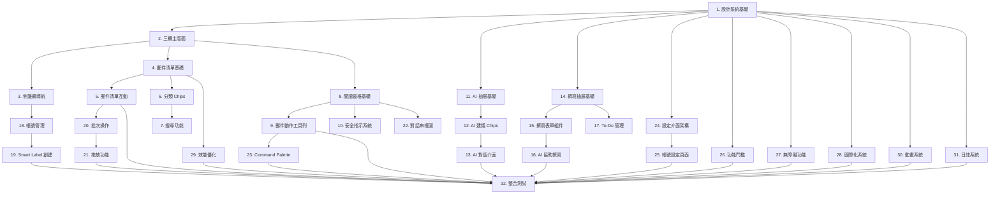

# Filo 風格 UI/UX 重構實作任務清單

## 任務概述

本任務清單將 Filo 風格 UI/UX 重構設計轉換為具體的程式碼實作步驟。**每個任務都專注於更新現有的程式碼組件**，採用測試驅動開發（TDD）方法，確保每個步驟都能建立在前一步的基礎上。

## 核心實作原則

**更新優於新建**：所有任務都應該優先考慮更新現有組件，而非創建新文件：

1. **現有文件優先**：在現有的 `.dart` 文件中添加功能，而非創建新文件
2. **擴展現有類別**：為現有組件添加新的樣式選項和功能
3. **保持 API 相容**：確保現有的使用方式不會中斷
4. **漸進式更新**：每次任務專注於特定組件的小幅改進

## 實作任務

- [x] 1. 擴展現有設計系統以支援 Filo 風格
  - **更新** `lib/shared/themes/macos_design_system.dart` 添加 Filo 風格 tokens
  - **擴展** `MacOSDesignSystem` 類別，添加 Filo 特有的色彩、字體、間距常數
  - **更新** `EnhancedThemeManager` 支援 Filo 主題切換
  - **擴展** 現有的動畫常數以符合 Filo 風格（120-160ms 過渡時間）
  - 建立單元測試驗證設計 tokens 的正確性
  - _需求: 1.4, 1.6, 1.7, 1.10_

- [x] 2. 更新主頁面實現三欄 Filo 風格佈局
  - **更新** `lib/presentation/pages/home/enhanced_macos_home_page.dart` 實現三欄佈局
  - **修改** 現有的佈局邏輯支援可調整的側邊欄寬度（240-264px，支援拖拽調整）
  - **擴展** 現有的 `ResponsiveLayout` 處理視窗大小變化
  - **更新** 版面狀態持久化邏輯（側邊欄寬度、摺疊狀態）
  - 撰寫 widget 測試驗證佈局響應式行為
  - _需求: 1.1, 1.3, 1.5_

- [x] 3. 更新側邊欄組件以符合 Filo 風格
  - **更新** `lib/presentation/widgets/macos/macos_enhanced_components.dart` 中的 `MacOSSidebar`
  - **擴展** 現有的 SidebarItem 組件支援 Filo 風格的圖示、文字、計數徽章
  - **修改** 選中狀態視覺效果（藍色背景、圓角）
  - **更新** 現有的 SidebarController 管理選中狀態和導航
  - 撰寫測試驗證側邊欄項目點擊和狀態更新
  - _需求: 1.2, 1.10_

- [x] 4. 更新郵件清單組件以符合 Filo 風格
  - **更新** `lib/presentation/widgets/email_list/email_list_widget.dart` 支援 Filo 風格渲染
  - **修改** `lib/presentation/widgets/email_list/email_list_item.dart` 實現 Filo 風格的頭像、主旨、摘要、時間佈局
  - **擴展** 現有的頭像組件支援圓形頭像和字母圈
  - **更新** 未讀/已讀狀態的字體和對比度差異（SF Pro Semi-Bold vs Regular）
  - 撰寫測試驗證郵件列表項目的正確渲染
  - _需求: 2.1, 2.2, 2.8_

- [x] 5. 擴展郵件清單互動功能
  - **更新** `email_list_item.dart` 添加 Filo 風格的 hover 效果和快速動作浮層
  - **擴展** 現有的滑動手勢支援（左滑封存、右滑刪除）
  - **修改** 現有的快速動作組件（封存/刪除/標記/加星/釘選）以符合 Filo 風格
  - **更新** hover 效果使用 150ms 平滑過渡動畫
  - 撰寫互動測試驗證手勢和快速動作
  - _需求: 2.3, 2.6, 1.7_

- [x] 6. 建立分類 Chips 組件
  - 實作 FiloMailboxChips widget 支援水平滾動
  - 建立 MailboxChip 組件（圓角膠囊設計、計數徽章）
  - 實作 chips 選中狀態和過濾功能
  - 建立 ChipController 管理 chips 狀態和郵件過濾
  - 撰寫測試驗證 chips 切換和過濾邏輯
  - _需求: 2.4, 2.5_

- [x] 7. 實作搜尋功能和運算子解析
  - 建立 FiloSearchBar 組件支援運算子輸入
  - 實作 SearchQueryParser 解析 from:/subject:/has:attachment
  - 建立 SearchChips 組件顯示解析後的搜尋條件
  - 實作搜尋防抖機制和即時結果更新
  - 撰寫測試驗證搜尋解析和結果過濾
  - _需求: 2.5, 11.2_

- [x] 8. 建立閱讀窗格基礎結構
  - 實作 FiloReadingPane widget 作為郵件閱讀容器
  - 建立 MessageHeader 組件（主旨 22-24px semi-bold）
  - 實作 MessageMeta 組件支援展開 To/Cc/Bcc 資訊
  - 建立 MessageContent 組件處理 HTML 內容正規化
  - 撰寫測試驗證閱讀窗格的內容渲染
  - _需求: 3.1, 3.2, 3.7_

- [x] 9. 實作郵件動作工具列
  - 建立 MessageActionBar 組件包含回覆/轉寄/封存等動作
  - 實作快捷鍵支援（R/A/F/E/S/.）
  - 建立 ActionButton 組件統一動作按鈕樣式
  - 實作右鍵選單整合
  - 撰寫測試驗證動作執行和快捷鍵響應
  - _需求: 3.3, 6.2_

- [ ] 10. 建立安全指示和警示系統
  - 實作 SecurityBadge 組件顯示 DKIM/SPF/DMARC 狀態
  - 建立 MessageBanner 組件支援 info/warning/danger/security 變體
  - 實作外部圖片載入控制和隱私提示
  - 建立 TrustIndicator 組件顯示寄件者信任等級
  - 撰寫測試驗證安全指示的正確顯示
  - _需求: 3.4, 3.5, 4.6_

- [ ] 11. 實作 AI 抽屜基礎架構
  - 建立 FiloAIDrawer widget 支援滑入/滑出動畫
  - 實作 AIDrawerController 管理抽屜狀態和持久化
  - 建立 AIDrawerHeader 組件包含標題和關閉按鈕
  - 實作抽屜寬度（360-380px）和響應式調整
  - 撰寫測試驗證抽屜開關和狀態持久化
  - _需求: 1.2, 4.5_

- [ ] 12. 建立 AI 建議 Chips 組件
  - 實作 AISuggestionChips 組件顯示預設建議
  - 建立 AISuggestionChip 組件支援點擊觸發
  - 實作建議 chips 的動態載入和個人化
  - 建立 AIActionController 處理 AI 功能觸發
  - 撰寫測試驗證 AI 建議的觸發和回應
  - _需求: 4.1, 4.2_

- [ ] 13. 實作 AI 對話和輸入介面
  - 建立 AIConversation 組件顯示 AI 對話歷史
  - 實作 AIInputField 組件支援 ⌘Enter 送出
  - 建立 AIMessage 組件區分使用者和 AI 訊息
  - 實作 AI 思考狀態和載入動畫
  - 撰寫測試驗證 AI 對話流程和輸入處理
  - _需求: 4.3, 4.4_

- [ ] 14. 更新撰寫頁面實現 Filo 風格底部抽屜
  - **更新** `lib/presentation/pages/compose/compose_page.dart` 實現底部抽屜式設計
  - **擴展** 現有的 ComposerController 管理撰寫狀態和草稿儲存
  - **修改** 現有的開啟/關閉動畫和鍵盤響應以符合 Filo 風格
  - **更新** 現有的 Header 組件包含 Filo 風格的關閉和最小化按鈕
  - 撰寫測試驗證撰寫抽屜的開關和狀態管理
  - _需求: 5.1, 5.3, 5.4_

- [ ] 15. 實作撰寫表單組件
  - 建立 ComposerFields 組件包含 To/Cc/Bcc/Subject 欄位
  - 實作 RecipientField 組件支援自動完成
  - 建立 ComposerEditor 組件支援富文本編輯
  - 實作草稿自動儲存機制
  - 撰寫測試驗證表單驗證和自動完成
  - _需求: 5.2, 5.5_

- [ ] 16. 建立 AI 協助撰寫功能
  - 實作 ComposerToolbar 組件包含 "Write with AI..." 按鈕
  - 建立 AIWritingAssistant 組件提供撰寫建議
  - 實作 AI 建議插入和格式保持
  - 建立 WritingStyleAnalyzer 分析使用者寫作風格
  - 撰寫測試驗證 AI 協助撰寫的功能
  - _需求: 5.7, 5.8_

- [ ] 17. 實作 To-Do 管理功能
  - 建立 FiloTodoList 組件支援 Active/Done 切換
  - 實作 TodoItem 組件包含到期 chips 和郵件關聯
  - 建立 DueChip 組件顯示到期狀態和排序
  - 實作 TodoController 管理待辦事項 CRUD 操作
  - 撰寫測試驗證 To-Do 功能和郵件關聯
  - _需求: 5.9, 5.10_

- [ ] 18. 建立帳號管理介面
  - 實作 FiloAccountSelector 組件顯示帳號選擇器
  - 建立 AccountCard 組件包含頭像、名稱、郵件地址
  - 實作帳號切換功能和平滑過渡動畫
  - 建立 AccountController 管理多帳號狀態
  - 撰寫測試驗證帳號切換和狀態更新
  - _需求: 7.1, 7.2, 7.3, 7.4_

- [ ] 19. 實作 Smart Label 創建功能
  - 建立 SmartLabelDialog 組件包含表單和色彩選擇器
  - 實作 ColorPicker 組件支援多種顏色選項
  - 建立 LabelFormValidator 驗證標籤名稱和描述
  - 實作字數統計和即時驗證
  - 撰寫測試驗證 Smart Label 創建流程
  - _需求: 7.5, 7.6, 7.7, 7.8, 7.9, 7.10_

- [ ] 20. 建立批次操作功能
  - 實作 BatchSelectionMode 支援多選郵件
  - 建立 BatchToolbar 組件顯示批次動作
  - 實作批次動作執行（封存/刪除/標記/加星）
  - 建立 SelectionController 管理選擇狀態
  - 撰寫測試驗證批次操作的正確執行
  - _需求: 6.1_

- [ ] 21. 實作拖放功能
  - 建立 DragDropHandler 支援郵件拖放到資料夾
  - 實作 AttachmentDragDrop 支援附件拖入/拖出
  - 建立拖放視覺回饋和目標高亮
  - 實作拖放操作的撤銷功能
  - 撰寫測試驗證拖放操作的正確性
  - _需求: 6.3, 6.4_

- [ ] 22. 建立對話串視圖
  - 實作 ConversationView 組件支援郵件串聯
  - 建立 ConversationNode 組件支援折疊/展開
  - 實作快速跳至最新郵件功能
  - 建立 ConversationController 管理對話串狀態
  - 撰寫測試驗證對話串的渲染和互動
  - _需求: 6.5_

- [ ] 23. 實作 Command Palette
  - 建立 FiloCommandPalette 組件支援 ⌘K 開啟
  - 實作 CommandSearch 組件支援模糊搜尋
  - 建立 CommandItem 組件顯示動作和快捷鍵
  - 實作命令分類和鍵盤導航
  - 撰寫測試驗證命令搜尋和執行
  - _需求: 6.6_

- [ ] 24. 更新設定介面以符合 Filo 風格
  - **更新** `lib/presentation/pages/settings/enhanced_settings_page.dart` 實現 Filo 風格的側邊欄和內容區域
  - **修改** 現有的 SettingsSidebar 組件包含所有設定分類並符合 Filo 設計
  - **擴展** 現有的 SettingsPage 基礎類別支援 Filo 統一樣式
  - **更新** 現有的 SettingsController 管理設定狀態和持久化
  - 撰寫測試驗證設定介面的導航和狀態
  - _需求: 10.1, 10.2, 10.7, 10.8_

- [ ] 25. 實作帳號設定頁面
  - 建立 AccountSettingsPage 組件顯示帳號資訊
  - 實作 ConnectedAccountsList 組件管理已連接帳號
  - 建立 AccountActionButtons 組件（Sign Out/Delete Account）
  - 實作帳號操作的確認對話框
  - 撰寫測試驗證帳號設定的功能
  - _需求: 10.3, 10.4, 10.5_

- [ ] 26. 建立功能門檻和升級提示
  - 實作 FeatureGate 組件攔截付費功能
  - 建立 UpgradePromptDialog 組件顯示方案比較
  - 實作使用量追蹤和限制檢查
  - 建立 SubscriptionController 管理訂閱狀態
  - 撰寫測試驗證功能門檻和升級流程
  - _需求: 8.1, 8.2, 8.3, 8.4, 8.5_

- [ ] 27. 實作無障礙功能
  - 建立 AccessibilityWrapper 組件提供語義標籤
  - 實作完整的鍵盤導航支援
  - 建立 FocusManager 管理焦點順序和焦點環
  - 實作螢幕閱讀器支援和 ARIA 標籤
  - 撰寫無障礙測試驗證 AA+ 標準合規性
  - _需求: 9.1, 9.2, 9.3_

- [ ] 28. 建立國際化系統
  - 實作 FiloLocalizations 類別支援多語言
  - 建立完整的繁體中文翻譯（基準語言）
  - 實作英文和日文翻譯（第二優先）
  - 建立 RTL 語言支援和佈局調整
  - 撰寫測試驗證多語言切換和顯示
  - _需求: 9.4, 9.5_

- [ ] 29. 實作效能優化
  - 建立 VirtualizedList 組件支援大量郵件渲染
  - 實作 ImageCache 系統快取頭像和附件縮圖
  - 建立 DebounceController 處理搜尋和輸入防抖
  - 實作 LazyLoading 支援按需載入郵件內容
  - 撰寫效能測試驗證渲染和記憶體使用
  - _需求: 11.1, 11.3, 11.2_

- [ ] 30. 建立動畫系統
  - 實作 FiloAnimations 類別定義所有過渡動畫
  - 建立 TransitionBuilder 支援統一的動畫效果
  - 實作 120-160ms 標準過渡時間
  - 建立 AnimationController 管理複雜動畫序列
  - 撰寫測試驗證動畫時間和流暢度
  - _需求: 11.4, 1.7_

- [ ] 31. 實作日誌系統
  - 建立 FiloLogger 類別支援繁體中文日誌
  - 實作不同日誌等級和格式化
  - 建立日誌過濾和搜尋功能
  - 實作日誌檔案管理和輪轉
  - 撰寫測試驗證日誌記錄和格式
  - _需求: 11.5_

- [ ] 32. 整合測試和品質保證
  - 建立端到端測試涵蓋主要使用者流程
  - 實作視覺回歸測試確保 UI 一致性
  - 建立效能基準測試和監控
  - 實作自動化無障礙測試
  - 撰寫完整的測試文件和測試計畫
  - _需求: 所有需求的整合驗證_

## 任務依賴關係

## 執行指南

1. **按順序執行任務**：嚴格按照任務編號順序執行，確保依賴關係正確
2. **更新優於新建**：每個任務都應該優先更新現有文件，避免創建新的實現文件
3. **測試驅動開發**：每個任務都應該先寫測試，再實作功能
4. **增量提交**：每完成一個任務就提交程式碼，保持小步前進
5. **程式碼審查**：每個任務完成後進行程式碼審查，確保品質
6. **文件更新**：隨時更新相關文件，保持文件與程式碼同步
7. **向後相容**：確保更新不會破壞現有功能和 API 介面

## 現有文件對應表

執行任務時，請優先更新以下現有文件：

| 功能領域 | 現有文件路徑 | 更新目標 |
|---------|-------------|----------|
| 主頁面 | `lib/presentation/pages/home/enhanced_macos_home_page.dart` | 三欄佈局、AI 抽屜 |
| 郵件清單 | `lib/presentation/widgets/email_list/email_list_widget.dart` | Filo 風格清單 |
| 郵件項目 | `lib/presentation/widgets/email_list/email_list_item.dart` | Filo 風格項目 |
| 側邊欄 | `lib/presentation/widgets/macos/macos_enhanced_components.dart` | Filo 風格導航 |
| 撰寫頁面 | `lib/presentation/pages/compose/compose_page.dart` | 底部抽屜式撰寫 |
| 設定頁面 | `lib/presentation/pages/settings/enhanced_settings_page.dart` | Filo 風格設定 |
| 設計系統 | `lib/shared/themes/macos_design_system.dart` | Filo 設計 tokens |
| 主題管理 | `lib/shared/themes/enhanced_theme_manager.dart` | Filo 主題支援 |
| 共用按鈕 | `lib/presentation/widgets/common/app_button.dart` | Filo 風格按鈕 |
| 共用卡片 | `lib/presentation/widgets/common/app_card.dart` | Filo 風格卡片 |

## 品質標準

- **更新優先原則**：每個任務必須優先更新現有文件，避免創建重複功能的新文件
- **向後相容性**：所有更新必須保持現有 API 和功能的相容性
- **測試覆蓋率**：每個組件至少 80% 測試覆蓋率
- **效能標準**：郵件清單滾動保持 60fps，載入時間 < 2 秒
- **無障礙標準**：符合 WCAG 2.1 AA+ 標準
- **程式碼品質**：通過 lint 檢查，符合團隊編碼規範
- **視覺一致性**：所有 UI 組件符合 Filo 設計規範

## 重要提醒

**🚨 執行任務時請務必遵循「更新優於新建」原則：**

1. **不要創建新的頁面文件**：更新現有的 `*_page.dart` 文件
2. **不要創建新的組件文件**：擴展現有的 widget 類別
3. **不要創建新的設計系統**：擴展現有的 `MacOSDesignSystem`
4. **保持文件結構穩定**：避免大幅重組現有的目錄結構
5. **優先使用現有 API**：在現有介面基礎上添加新功能