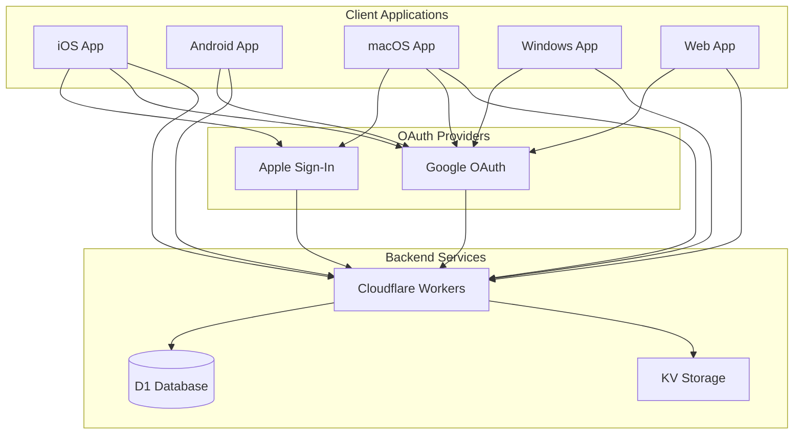
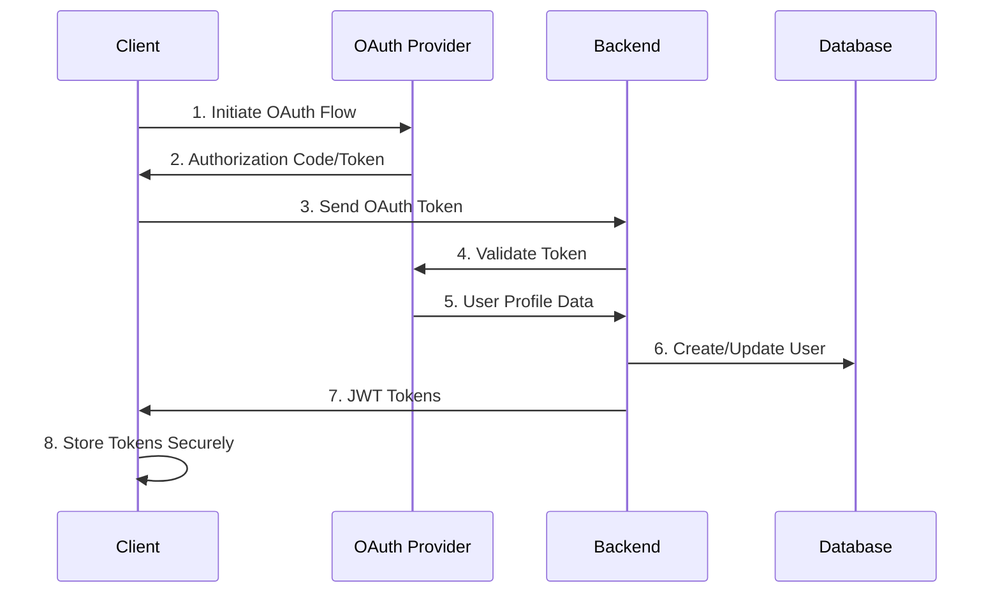

# OAuth Integration Design Document

## Overview

This document outlines the technical design for integrating OAuth authentication (Google and Apple Sign-In) into the Awesome Mail application. The design maintains compatibility with the existing authentication system while adding seamless OAuth capabilities across all supported platforms.

The integration will extend the current JWT-based authentication system to support OAuth providers, allowing users to sign in with their Google or Apple accounts while maintaining the same security and session management standards.

## Architecture

### High-Level Architecture



### OAuth Flow Architecture



## Components and Interfaces

### Frontend Components

#### 1. OAuth Service (Flutter)

```dart
abstract class OAuthService {
  Future<OAuthResult> signInWithGoogle();
  Future<OAuthResult> signInWithApple();
  Future<bool> isGoogleAvailable();
  Future<bool> isAppleAvailable();
  Future<void> signOut(OAuthProvider provider);
}

class OAuthResult {
  final bool isSuccess;
  final String? accessToken;
  final String? idToken;
  final String? error;
  final Map<String, dynamic>? userInfo;
}

enum OAuthProvider { google, apple }
```

#### 2. Enhanced Auth Service

The existing `AuthService` will be extended with OAuth methods:

```dart
class AuthService {
  // Existing methods...
  
  Future<AuthResult> signInWithOAuth({
    required OAuthProvider provider,
    required String accessToken,
    String? idToken,
    required String deviceId,
  });
  
  Future<AuthResult> linkOAuthProvider({
    required OAuthProvider provider,
    required String accessToken,
    String? idToken,
  });
  
  Future<bool> unlinkOAuthProvider(OAuthProvider provider);
  Future<List<OAuthProvider>> getLinkedProviders();
}
```

#### 3. OAuth UI Components

```dart
class OAuthSignInButtons extends StatelessWidget {
  final VoidCallback? onGoogleSignIn;
  final VoidCallback? onAppleSignIn;
  final bool isLoading;
}

class OAuthLinkingWidget extends StatelessWidget {
  final List<OAuthProvider> linkedProviders;
  final Function(OAuthProvider) onLink;
  final Function(OAuthProvider) onUnlink;
}
```

### Backend Components

#### 1. OAuth Validation Service

```typescript
interface OAuthValidationService {
  validateGoogleToken(accessToken: string): Promise<GoogleUserInfo>;
  validateAppleToken(idToken: string): Promise<AppleUserInfo>;
}

interface GoogleUserInfo {
  id: string;
  email: string;
  name: string;
  picture?: string;
  verified_email: boolean;
}

interface AppleUserInfo {
  sub: string;
  email?: string;
  email_verified?: boolean;
  name?: {
    firstName?: string;
    lastName?: string;
  };
}
```

#### 2. Enhanced Auth Service (Backend)

```typescript
class AuthService {
  // Existing methods...
  
  async authenticateWithOAuth(
    provider: 'google' | 'apple',
    token: string,
    deviceId: string
  ): Promise<LoginResponse>;
  
  async linkOAuthProvider(
    userId: string,
    provider: 'google' | 'apple',
    token: string
  ): Promise<boolean>;
  
  async unlinkOAuthProvider(
    userId: string,
    provider: 'google' | 'apple'
  ): Promise<boolean>;
}
```

#### 3. Database Schema Extensions

```sql
-- OAuth providers table
CREATE TABLE oauth_providers (
  id TEXT PRIMARY KEY,
  user_id TEXT NOT NULL,
  provider TEXT NOT NULL, -- 'google' or 'apple'
  provider_user_id TEXT NOT NULL,
  email TEXT,
  name TEXT,
  avatar_url TEXT,
  created_at TEXT NOT NULL,
  updated_at TEXT NOT NULL,
  FOREIGN KEY (user_id) REFERENCES users (id) ON DELETE CASCADE,
  UNIQUE(provider, provider_user_id),
  UNIQUE(user_id, provider)
);

-- Index for efficient lookups
CREATE INDEX idx_oauth_providers_user_id ON oauth_providers(user_id);
CREATE INDEX idx_oauth_providers_provider_user_id ON oauth_providers(provider, provider_user_id);
```

## Data Models

### Frontend Models

```dart
@JsonSerializable()
class OAuthProvider {
  final String provider; // 'google' or 'apple'
  final String providerUserId;
  final String? email;
  final String? name;
  final String? avatarUrl;
  final DateTime linkedAt;
}

@JsonSerializable()
class EnhancedUserProfile extends UserProfile {
  final List<OAuthProvider> linkedProviders;
  
  // Existing UserProfile fields...
}
```

### Backend Models

```typescript
interface OAuthProviderRecord {
  id: string;
  userId: string;
  provider: 'google' | 'apple';
  providerUserId: string;
  email?: string;
  name?: string;
  avatarUrl?: string;
  createdAt: string;
  updatedAt: string;
}

interface OAuthAuthenticationRequest {
  provider: 'google' | 'apple';
  accessToken?: string;
  idToken?: string;
  deviceId: string;
}
```

## Error Handling

### OAuth-Specific Errors

```dart
class OAuthException implements Exception {
  final OAuthErrorType type;
  final String message;
  final String? provider;
  
  const OAuthException(this.type, this.message, [this.provider]);
}

enum OAuthErrorType {
  cancelled,
  networkError,
  invalidToken,
  providerError,
  accountLinkingFailed,
  alreadyLinked,
  notSupported,
}
```

### Error Handling Strategy

1. **Client-Side Errors**: Handle OAuth cancellation, network issues, and provider-specific errors
2. **Server-Side Validation**: Validate OAuth tokens and handle provider API errors
3. **Account Linking Conflicts**: Handle cases where OAuth email conflicts with existing accounts
4. **Graceful Degradation**: Fall back to email/password when OAuth is unavailable

## Testing Strategy

### Unit Tests

#### Frontend Tests
```dart
// OAuth Service Tests
testWidgets('Google sign-in success flow', (tester) async {
  // Test successful Google OAuth flow
});

testWidgets('Apple sign-in cancellation', (tester) async {
  // Test user cancellation handling
});

testWidgets('OAuth account linking', (tester) async {
  // Test linking OAuth to existing account
});
```

#### Backend Tests
```typescript
describe('OAuth Authentication', () => {
  test('should validate Google token successfully', async () => {
    // Test Google token validation
  });
  
  test('should handle invalid Apple token', async () => {
    // Test Apple token validation error
  });
  
  test('should link OAuth provider to existing user', async () => {
    // Test account linking
  });
});
```

### Integration Tests

1. **End-to-End OAuth Flow**: Test complete OAuth authentication from client to backend
2. **Cross-Platform Compatibility**: Verify OAuth works on all supported platforms
3. **Account Linking Scenarios**: Test various account linking and unlinking scenarios
4. **Error Recovery**: Test error handling and recovery mechanisms

### Platform-Specific Tests

1. **iOS/macOS**: Test Apple Sign-In integration and keychain storage
2. **Android**: Test Google Sign-In integration and secure storage
3. **Web**: Test OAuth popup/redirect flows
4. **Windows**: Test OAuth with system browser integration

## Security Considerations

### Token Security

1. **Secure Storage**: OAuth tokens stored using same secure storage as existing credentials
2. **Token Validation**: All OAuth tokens validated server-side before creating sessions
3. **Scope Limitation**: Request minimal necessary scopes from OAuth providers
4. **Token Refresh**: Handle OAuth token refresh when supported by provider

### Account Security

1. **Email Verification**: Verify OAuth provider email addresses before account linking
2. **Account Takeover Prevention**: Prevent unauthorized account linking through proper validation
3. **Audit Logging**: Log all OAuth authentication and linking events
4. **Revocation Handling**: Handle OAuth access revocation gracefully

### Privacy Protection

1. **Data Minimization**: Only store necessary user information from OAuth providers
2. **Apple Privacy**: Handle Apple's private relay email addresses appropriately
3. **GDPR Compliance**: Ensure OAuth data handling complies with privacy regulations
4. **User Consent**: Clear consent flow for OAuth data usage

## Platform-Specific Implementation Details

### iOS/macOS Implementation

```dart
// Using sign_in_with_apple package
class AppleOAuthService implements OAuthService {
  @override
  Future<OAuthResult> signInWithApple() async {
    try {
      final credential = await SignInWithApple.getAppleIDCredential(
        scopes: [
          AppleIDAuthorizationScopes.email,
          AppleIDAuthorizationScopes.fullName,
        ],
      );
      
      return OAuthResult(
        isSuccess: true,
        idToken: credential.identityToken,
        userInfo: {
          'user_id': credential.userIdentifier,
          'email': credential.email,
          'name': credential.givenName != null 
            ? '${credential.givenName} ${credential.familyName}'
            : null,
        },
      );
    } catch (e) {
      return OAuthResult(isSuccess: false, error: e.toString());
    }
  }
}
```

### Android/Web Implementation

```dart
// Using google_sign_in package
class GoogleOAuthService implements OAuthService {
  final GoogleSignIn _googleSignIn = GoogleSignIn(
    scopes: ['email', 'profile'],
  );
  
  @override
  Future<OAuthResult> signInWithGoogle() async {
    try {
      final account = await _googleSignIn.signIn();
      if (account == null) {
        return OAuthResult(isSuccess: false, error: 'Sign in cancelled');
      }
      
      final auth = await account.authentication;
      
      return OAuthResult(
        isSuccess: true,
        accessToken: auth.accessToken,
        idToken: auth.idToken,
        userInfo: {
          'user_id': account.id,
          'email': account.email,
          'name': account.displayName,
          'photo_url': account.photoUrl,
        },
      );
    } catch (e) {
      return OAuthResult(isSuccess: false, error: e.toString());
    }
  }
}
```

### Backend OAuth Validation

```typescript
class OAuthValidationService {
  async validateGoogleToken(accessToken: string): Promise<GoogleUserInfo> {
    const response = await fetch(
      `https://www.googleapis.com/oauth2/v2/userinfo?access_token=${accessToken}`
    );
    
    if (!response.ok) {
      throw new Error('Invalid Google token');
    }
    
    return await response.json();
  }
  
  async validateAppleToken(idToken: string): Promise<AppleUserInfo> {
    // Validate Apple ID token using Apple's public keys
    const decoded = await this.verifyAppleIdToken(idToken);
    return decoded;
  }
  
  private async verifyAppleIdToken(idToken: string): Promise<AppleUserInfo> {
    // Implementation for Apple ID token verification
    // This involves fetching Apple's public keys and verifying the JWT
    // Details omitted for brevity
  }
}
```

## Migration Strategy

### Phase 1: Backend OAuth Support
1. Add OAuth validation endpoints
2. Extend user database schema
3. Implement OAuth provider linking logic
4. Add comprehensive tests

### Phase 2: Frontend OAuth Integration
1. Add OAuth service implementations
2. Update authentication UI
3. Implement account linking flows
4. Add platform-specific OAuth handling

### Phase 3: Enhanced Features
1. Add OAuth account management UI
2. Implement OAuth token refresh
3. Add advanced security features
4. Optimize user experience

### Backward Compatibility

1. **Existing Users**: All existing authentication methods continue to work
2. **API Compatibility**: New OAuth endpoints don't affect existing API contracts
3. **Database Migration**: Schema changes are additive and don't affect existing data
4. **Gradual Rollout**: OAuth features can be enabled progressively per platform