# Testing Strategy - Awesome Mail

This document outlines the comprehensive testing strategy for Awesome Mail, following Test-Driven Development (TDD) principles.

## 🎯 Testing Philosophy

### Core Principles
- **Red-Green-Refactor Cycle**: Always write failing tests first, then implement the minimum code to pass, then refactor
- **Test First**: Every feature starts with a test
- **Quality Gates**: Maintain >90% test coverage
- **Fast Feedback**: Tests should run quickly and provide immediate feedback
- **Isolation**: Each test should be independent and not rely on external state

### TDD Workflow

```mermaid
graph LR
    A[🔴 Red<br/>Write Failing Test] --> B[🟢 Green<br/>Make Test Pass]
    B --> C[🔵 Refactor<br/>Improve Code]
    C --> A
```


## 📊 Test Coverage Requirements

| Component | Unit Tests | Integration Tests | E2E Tests | Coverage Target |
|-----------|------------|-------------------|-----------|-----------------|
| Backend Services | ✅ Required | ✅ Required | ✅ API Tests | >90% |
| Flutter Core | ✅ Required | ✅ Required | ✅ User Flows | >90% |
| UI Components | ✅ Widget Tests | ✅ Integration | ✅ User Interactions | >80% |
| AI Features | ✅ Mock Tests | ✅ Real API Tests | ✅ End-to-End | >85% |

## 🏗️ Test Architecture

### Backend Testing (Cloudflare Workers)
```
awesome-mail/
├── tests/
│   ├── setup/
│   │   └── test-setup.ts          # Global test configuration
│   ├── unit/
│   │   ├── services/              # Service layer tests
│   │   ├── repositories/          # Data access tests
│   │   ├── utils/                 # Utility function tests
│   │   └── jobs/                  # Background job tests
│   ├── integration/
│   │   ├── api/                   # API endpoint tests
│   │   ├── ai/                    # AI service integration
│   │   └── auth/                  # Authentication flow tests
│   └── fixtures/
│       └── test-data.ts           # Test data factory
└── vitest.config.ts               # Test configuration
```

### Flutter Testing
```
awesome_mail_flutter/
├── test/
│   ├── unit/                      # Unit tests
│   │   ├── core/                  # Core functionality
│   │   ├── data/                  # Data models and repositories
│   │   └── presentation/          # Business logic (BLoCs)
│   ├── widget/                    # Widget tests
│   │   ├── core/                  # Core widgets
│   │   ├── presentation/          # UI components
│   │   └── shared/                # Shared widgets
│   ├── fixtures/                  # Test data
│   ├── test_helpers.dart          # Test utilities
│   └── flutter_test_config.dart   # Test configuration
├── integration_test/              # Integration tests
│   ├── auth_flow_test.dart        # Authentication flows
│   ├── email_management_test.dart # Email operations
│   ├── ai_features_test.dart      # AI functionality
│   └── sync_test.dart             # Cross-device sync
└── analysis_options.yaml         # Code analysis rules
```

## 🧪 Test Types and Examples

### 1. Unit Tests

#### Backend Unit Test Example
```typescript
// tests/unit/services/email-service.test.ts
import { describe, it, expect, beforeEach } from 'vitest';
import { EmailService } from '@/services/email-service';
import { TestDataFactory } from '@/tests/setup/test-setup';

describe('EmailService', () => {
  let emailService: EmailService;

  beforeEach(() => {
    emailService = new EmailService();
  });

  describe('classifyEmail', () => {
    it('should classify meeting emails correctly', async () => {
      // Arrange
      const email = TestDataFactory.createTestEmail({
        subject: 'Team Meeting Tomorrow',
        body: 'Please join us for the weekly team meeting'
      });

      // Act
      const result = await emailService.classifyEmail(email);

      // Assert
      expect(result.category).toBe('meeting');
      expect(result.confidence).toBeGreaterThan(0.8);
    });
  });
});
```

#### Flutter Unit Test Example
```dart
// test/unit/data/models/email_test.dart
import 'package:flutter_test/flutter_test.dart';
import 'package:awesome_mail_flutter/data/models/email.dart';
import '../../test_helpers.dart';

void main() {
  group('Email Model', () {
    test('should create email with valid data', () {
      // Arrange
      final email = TestDataFactory.createTestEmail(
        subject: 'Test Subject',
        from: 'test@example.com',
      );

      // Act & Assert
      TestAssertions.assertValidEmail(email);
      expect(email.subject, equals('Test Subject'));
    });
  });
}
```

### 2. Widget Tests

```dart
// test/widget/email_list_item_test.dart
import 'package:flutter/material.dart';
import 'package:flutter_test/flutter_test.dart';
import 'package:awesome_mail_flutter/presentation/widgets/email_list_item.dart';
import '../test_helpers.dart';

void main() {
  group('EmailListItem Widget', () {
    testWidgets('should display email information', (tester) async {
      // Arrange
      final email = TestDataFactory.createTestEmail();
      final widget = EmailListItem(email: email, onTap: () {});

      // Act
      await tester.pumpWidget(TestHelpers.createTestWidget(widget));

      // Assert
      expect(find.text(email.subject), findsOneWidget);
      expect(find.text(email.from.email), findsOneWidget);
    });
  });
}
```

### 3. Integration Tests

```dart
// integration_test/email_flow_test.dart
import 'package:flutter_test/flutter_test.dart';
import 'package:integration_test/integration_test.dart';
import 'package:awesome_mail_flutter/main.dart' as app;

void main() {
  IntegrationTestWidgetsFlutterBinding.ensureInitialized();

  group('Email Management Flow', () {
    testWidgets('complete email reading flow', (tester) async {
      // Arrange
      app.main();
      await tester.pumpAndSettle();

      // Act & Assert - Login
      await _performLogin(tester);
      
      // Act & Assert - Read Email
      await _readEmail(tester);
      
      // Act & Assert - Reply
      await _replyToEmail(tester);
    });
  });
}
```

## 🚀 Running Tests

### Quick Start
```bash
# Run all tests
./scripts/test-runner.sh

# Run only backend tests
./scripts/test-runner.sh --backend-only

# Run only Flutter tests
./scripts/test-runner.sh --flutter-only

# Run with AI integration tests
./scripts/test-runner.sh --with-ai

# Clean test artifacts
./scripts/test-runner.sh --clean
```

### Individual Test Commands

#### Backend Tests
```bash
cd awesome-mail

# Unit tests only
npm run test:mock-only

# With coverage
npm run test:coverage

# AI integration tests (requires API keys)
ENABLE_REAL_AI_API_TESTS=true npm run test:ai

# Watch mode for TDD
npm run test:watch
```

#### Flutter Tests
```bash
cd awesome_mail_flutter

# Unit tests
flutter test test/unit/

# Widget tests
flutter test test/widget/

# Integration tests
flutter test integration_test/

# With coverage
flutter test --coverage

# Update golden files
flutter test --update-goldens
```

## 📈 Coverage Reports

### Viewing Coverage Reports
- **Backend**: Open `awesome-mail/coverage/index.html`
- **Flutter**: Open `awesome_mail_flutter/coverage/html/index.html`

### Coverage Thresholds
- **Lines**: >90%
- **Functions**: >90%
- **Branches**: >80%
- **Statements**: >90%

## 🔧 Test Configuration

### Backend Configuration (vitest.config.ts)
```typescript
export default defineConfig({
  test: {
    globals: true,
    environment: 'node',
    setupFiles: ['./tests/setup/test-setup.ts'],
    coverage: {
      thresholds: {
        lines: 90,
        functions: 90,
        branches: 80,
        statements: 90
      }
    }
  }
});
```

### Flutter Configuration (flutter_test_config.dart)
```dart
Future<void> testExecutable(FutureOr<void> Function() testMain) async {
  TestWidgetsFlutterBinding.ensureInitialized();
  
  return AlchemistConfig.runWithConfig(
    config: const AlchemistConfig(
      platformGoldensConfig: PlatformGoldensConfig(enabled: true),
    ),
    run: testMain,
  );
}
```

## 🎨 Test Data Management

### Test Data Factory Pattern
```dart
class TestDataFactory {
  static Email createTestEmail({
    String? subject,
    String? from,
    DateTime? receivedAt,
  }) {
    return Email(
      id: 'test_${DateTime.now().millisecondsSinceEpoch}',
      subject: subject ?? 'Test Subject',
      from: EmailAddress(from ?? 'test@example.com', 'Test User'),
      receivedAt: receivedAt ?? DateTime.now(),
      // ... other properties
    );
  }
}
```

### Mock Services
```dart
class MockEmailService extends Mock implements EmailService {}

void main() {
  late MockEmailService mockEmailService;
  
  setUp(() {
    mockEmailService = MockEmailService();
    when(mockEmailService.getEmails()).thenAnswer(
      (_) async => TestDataFactory.createTestEmailList(5),
    );
  });
}
```

## 🔄 CI/CD Integration

### GitHub Actions Workflows
- **Backend CI**: `.github/workflows/backend-ci.yml`
- **Flutter CI**: `.github/workflows/flutter-ci.yml`
- **Quality Gates**: `.github/workflows/quality-gates.yml`

### Quality Gates
1. **Code Analysis**: Linting and static analysis
2. **Test Coverage**: Minimum coverage thresholds
3. **Security Scan**: Vulnerability scanning
4. **Performance**: Load and performance testing

## 📝 TDD Best Practices

### 1. Write Tests First
```typescript
// ❌ Wrong: Implementation first
function calculateTotal(items) {
  return items.reduce((sum, item) => sum + item.price, 0);
}

// ✅ Correct: Test first
describe('calculateTotal', () => {
  it('should calculate total price of items', () => {
    const items = [{ price: 10 }, { price: 20 }];
    expect(calculateTotal(items)).toBe(30);
  });
});
```

### 2. Keep Tests Simple
```dart
// ❌ Wrong: Complex test with multiple assertions
test('email operations', () {
  final email = createEmail();
  expect(email.isValid, isTrue);
  expect(email.canReply, isTrue);
  expect(email.hasAttachments, isFalse);
  // Too many concerns in one test
});

// ✅ Correct: Single responsibility
test('should validate email correctly', () {
  final email = createValidEmail();
  expect(email.isValid, isTrue);
});

test('should allow replies for non-spam emails', () {
  final email = createNonSpamEmail();
  expect(email.canReply, isTrue);
});
```

### 3. Use Descriptive Test Names
```typescript
// ❌ Wrong: Vague test name
it('should work', () => { /* ... */ });

// ✅ Correct: Descriptive test name
it('should classify meeting emails with high confidence when subject contains meeting keywords', () => {
  /* ... */
});
```

### 4. Follow AAA Pattern
```dart
test('should mark email as read when opened', () {
  // Arrange
  final email = TestDataFactory.createUnreadEmail();
  final emailService = EmailService();
  
  // Act
  emailService.markAsRead(email.id);
  
  // Assert
  expect(email.isRead, isTrue);
});
```

## 🐛 Debugging Tests

### Common Issues and Solutions

#### 1. Flaky Tests
```dart
// ❌ Problem: Time-dependent test
test('should expire after 1 second', () async {
  final token = createToken();
  await Future.delayed(Duration(seconds: 1));
  expect(token.isExpired, isTrue);
});

// ✅ Solution: Mock time
test('should expire after timeout', () {
  final mockClock = MockClock();
  final token = createToken(clock: mockClock);
  mockClock.advance(Duration(seconds: 1));
  expect(token.isExpired, isTrue);
});
```

#### 2. Async Test Issues
```dart
// ❌ Problem: Not awaiting async operations
test('should load emails', () {
  emailService.loadEmails(); // Missing await
  expect(emails, isNotEmpty);
});

// ✅ Solution: Proper async handling
test('should load emails', () async {
  await emailService.loadEmails();
  expect(emails, isNotEmpty);
});
```

## 📚 Resources

### Documentation
- [Flutter Testing Guide](https://docs.flutter.dev/testing)
- [Vitest Documentation](https://vitest.dev/)
- [TDD Best Practices](https://martinfowler.com/bliki/TestDrivenDevelopment.html)

### Tools
- **Backend**: Vitest, Mockito, Supertest
- **Flutter**: flutter_test, mockito, bloc_test, alchemist
- **CI/CD**: GitHub Actions, Codecov
- **Coverage**: lcov, c8, Istanbul

### Commands Reference
```bash
# Backend
npm run test              # Run all tests
npm run test:watch        # Watch mode
npm run test:coverage     # With coverage
npm run test:ui          # UI mode

# Flutter
flutter test             # Run all tests
flutter test --coverage  # With coverage
flutter test --watch     # Watch mode
flutter test --update-goldens  # Update golden files

# Scripts
./scripts/test-runner.sh           # Run all tests
./scripts/test-runner.sh --help    # Show help
```

## 🎯 Success Metrics

### Quality Indicators
- ✅ All tests passing
- ✅ Coverage >90% (unit), >80% (integration)
- ✅ No flaky tests
- ✅ Fast test execution (<5 minutes total)
- ✅ Clear test failure messages

### TDD Compliance Checklist
- [ ] Tests written before implementation
- [ ] Red-Green-Refactor cycle followed
- [ ] Each test focuses on single behavior
- [ ] Tests are independent and isolated
- [ ] Descriptive test names and clear assertions
- [ ] Proper test data management
- [ ] Mock external dependencies
- [ ] Regular refactoring with test safety net

---

Remember: **TDD is not about testing, it's about design!** Tests drive better architecture, clearer interfaces, and more maintainable code.